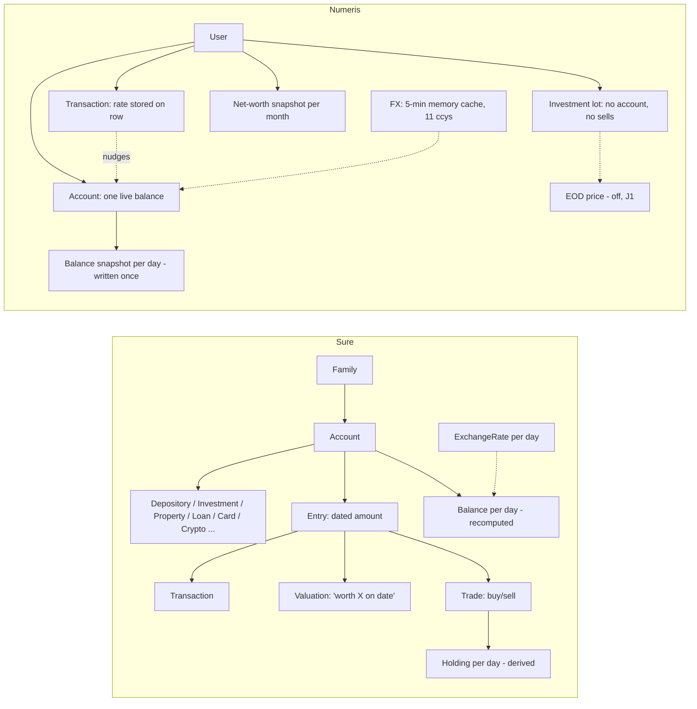

# What Numeris should learn from Sure

## One screen for Thomas

Sure is the community fork of Maybe Finance: a self-hosted Rails app with about 40 bank and broker connectors. I read its data model, sync, categorisation, investments, currency, import, budgets, apps, design system, agent instructions and tests, and compared each area with the Numeris code as of commit `457df64`.

**The big idea.** Sure never stores "the balance" as one number that it edits. Every account is a list of dated entries (transactions, trades and "the balance was X on this date" valuations), and it recomputes the daily balance from them. Numeris keeps one live figure per account and nudges it on every edit. Most of what is worth learning follows from that one difference.

**Top 5 things to learn, in order**

| # | What | Effort | Why it matters to Numeris |
|---|---|---|---|
| 1 | **A human edit wins.** Lock any field the user changed and record who set each value (user, rule, AI, bank). AI runs, rules and bank re-syncs skip locked fields. | M | Today an AI categorisation run can overwrite a category the user chose by hand. It is also the groundwork for undoing a whole AI run, for bank sync and for cost basis. |
| 2 | **Dated valuations per account.** Add a "worth X on date D" entry, plus an opening anchor, for property, pensions and anything else without a transaction feed. | M | Property and pension history appear, and editing a balance stops being a silent overwrite. |
| 3 | **A daily exchange-rate table, filled by a scheduled job.** Store `(from, to, date, rate)` once a day and convert history at the rate of its day. | M (fetch job S) | Numeris has only a 5-minute in-memory cache of 11 currencies, so it cannot convert past balances honestly. It also fixes the drift bug below. |
| 4 | **Investments as a trade ledger.** Holdings are computed from buys and sells, the average cost matches a UK section-104 pool, and contributions are split from market moves. | L | Today there are no sells, no realised gains and no return figure. A return and XIRR (annualised return) also work with **no price feed**. |
| 5 | **A tighter AI categoriser.** The model may answer only with the user's own categories or "don't know" (S). A small per-user Bayes model runs first and handles repeat merchants, so the LLM sees only the rest (S-M). | S then S-M | Today the model can invent categories and its answers are applied unreviewed. This is the realistic, UK-hostable form of SharkFin's "local model at about 90%". |

**Sure's data model and Numeris's, side by side**



In words: in Sure, account → entries (transaction | valuation | trade) → recomputed daily balances and holdings. In Numeris, account → one live balance nudged by transactions, with investments floating beside the accounts.

**Bugs this study found in Numeris** (each one confirmed against the code on 29 Sep; none fixed here, because this task was ideas only)

- The web CSV import sends `accountId: 0` (`csv-import.tsx:185`), and the server returns 404 when there is no such account (`routes/import.ts:58-61`). Reading the code, every web CSV import fails. It was not run.
- Connecting a second bank through Enable Banking overwrites the first, because the upsert key is `(userId, provider)` (`routes/enable-banking.ts:156`).
- Editing or deleting an old foreign-currency transaction moves the balance at **today's** rate, not the rate it was created at (`lib/balance.ts:88-93`).
- Mortgages exist only in browser storage (`pages/mortgage.tsx:57-69`, key `ft-mortgages`). They do not sync between devices and are not in net worth.
- Categorisation rules (`ft-cat-rules`) and budget rollover (`budget.tsx:68-77,1221-1239`) also live only in browser storage. The rollover pot never shrinks when you overspend.
- The AI categoriser prompt says "Add new only if none fit" (`lib/ai-context.ts:878`), and the reply is only type-checked, so an invented category is accepted.
- The biometric-lock toggle (`MobileSettings.tsx:68,128`) is on-screen state only, with no plugin behind it. That is a control that does nothing (DESIGN.md §16).
- There is no CI: `.github/workflows/` holds only `keep-alive.yml`.
- Detected recurring patterns reset to `active` on every GET (`routes/recurring.ts:38,48`), so a dismissal never sticks.

**Where Numeris is already ahead of Sure**

- **Currency conversion.** Sure silently falls back to a 1:1 rate when one is missing; Numeris removed exactly that defect. Numeris also records the rate and its date on every row, where Sure keeps them in a free-form JSON field.
- **CSV duplicate detection.** Numeris's ordinal hashing (`file-dedup.ts`) is sharper than Sure's match on amount and date.
- **Receipts.** Numeris reads receipts, including splitting a group bill to the penny. Sure has no OCR at all.
- **Market-data licensing.** Numeris reasons about it and puts the feed behind a flag that fails closed; Sure's repo contains no licence reasoning.
- **Recurring detection.** Numeris finds weekly, quarterly and yearly patterns; Sure's is effectively monthly-only.
- **Linked IOUs between users.** Sure has no equivalent.
- **Regulatory position.** Numeris states explicitly that it never moves money.

**The market-data decision (J1): nothing in Sure changes it. Stay at tier 0.**

- Sure avoids licensing only because each self-hoster enters their own API key; a hosted Numeris cannot do that.
- Sure's hosted "managed" mode scrapes Yahoo and serves prices through a public API with no licence reasoning at all. It is not a precedent.
- One new question for J1: **"tier 0.5"**. Trading 212 and IBKR return each position with the broker's own price, so a holding could be valued without a vendor feed. First, those brokers' API terms need the same clause-by-clause reading (Trading 212's API is personal-use).

**UK bank feeds, from Sure's code**

- Plaid in Sure leaves GB out of its country list.
- Sure has no GoCardless and no TrueLayer code.
- Its Enable Banking connector works in the UK only because each user pastes their own app credentials.
- For a hosted UK product, Enable Banking with a contract and KYB (business verification) remains the path already in `docs/OPEN-BANKING.md`. Sure offers no shortcut.

**How to use this doc.** Each section below says what Sure does, what Numeris does today, a ranked list with effort (S under a day, M 1-3 days, L a week or more), and where Numeris is ahead. Anything Numeris adopts is redesigned and rewritten, and the Numeris doc or PR that uses it notes "idea from Sure (AGPLv3), `<file/area>`". Sections were written by five parallel readers and every Numeris bug claim above was re-checked by hand. The "What was read" appendix states each reader's coverage.

---

## 1. Data model

### The two models in text

#### Sure core data model

```
Family (currency, enabled_currencies, locale) -> has many Users (role: guest|member|admin|super_admin)
Family -> has many Accounts (currency, balance, cash_balance, classification: asset|liability, owner_id)
  Account -> accountable (polymorphic) -> Depository | Investment | Crypto | Property | Vehicle | OtherAsset | CreditCard | Loan | OtherLiability
  Account -> account_shares -> User (permission: read_only|read_write|full_control)
  Account -> has many Entries (date, amount, currency, name, excluded, parent_entry_id)
    Entry -> entryable (polymorphic) -> Transaction (kind, category, merchant, tags, extra.exchange_rate)
                                      | Valuation (kind: opening_anchor|current_anchor|reconciliation)
                                      | Trade (security, qty, price, fee, currency)
  Account -> has many Holdings (security, date, qty, price, amount, currency, cost_basis)
  Account -> has many Balances (date, currency, start/flows/adjustments -> generated end_* columns)
Transfer -> outflow_transaction + inflow_transaction (status: pending|confirmed)
Merchant (STI) -> FamilyMerchant | ProviderMerchant ; Tag -> taggings (polymorphic)
ExchangeRate (from, to, date, rate) ; ExchangeRatePair (from, to, provider_name, first_provider_rate_on)
```

#### Numeris core data model

```
user (better-auth) -> app_settings.base_currency (default GBP)
user -> accounts (id serial, currency, balance live scalar, type: cash|investment|pension|property|other|liability, external_provider/external_id)
  accounts -> account_balance_snapshots (date, balance, currency, native_to_base_rate, rate_as_of; write-once per day, lazy)
user -> transactions (date, type: income|expense|transfer, category text, account_id, native_amount, currency,
                      native_to_base_rate, rate_as_of, transfer_group_id, transfer_direction: out|in)
user -> investments (ticker, shares, cost_price_per_share, buy_date)   -- no account_id, no currency column
  investments -> eod_prices (ticker, session_date, close, currency, provider)   -- global, not per user
user -> nw_snapshots (month, cash, investment, pension, property, other)   -- per-type aggregates, monthly
user -> debts (person, direction, native_amount, currency, linked_user_id) ; shared_expenses -> participants -> settlements
user -> connections (provider credentials) ; recurring_patterns ; subscriptions ; upcoming ; budgets ; goals
FX: no table. getFxRates() in-memory 5 min cache, GBP-pivoted, Yahoo -> Frankfurter fallback, 11 currencies
```


### What Sure does

**Account + delegated type.** `accounts` carries the common columns (name, currency, balance, cash_balance, status,
family_id, owner_id) and a polymorphic `accountable_type/accountable_id` pointing at one of nine type tables listed in
`app/models/concerns/accountable.rb` (Depository, Investment, Crypto, Property, Vehicle, OtherAsset, CreditCard, Loan,
OtherLiability). Each type table holds only what is specific to it (a Loan has rate and term, a Property has address,
a CreditCard has APR and limit). Each type declares `classification` (asset or liability), icon, colour and a
`SUBTYPES` map. `accounts.classification` is a Postgres generated column derived from `accountable_type`, so the sign
of an account can never disagree with its type. Liabilities are stored positive; the type supplies the sign.

**Entry + entryable (the ledger).** Every dated money event on an account is one `entries` row (date, amount,
currency, name, excluded flag, `parent_entry_id` for splits, `external_id`/`plaid_id`, `import_locked`,
`user_modified`, `locked_attributes`). The row delegates to one of three types (`app/models/entryable.rb`):
- `Transaction`: category, merchant, tags, and a `kind` enum (`standard`, `funds_movement`, `cc_payment`,
  `loan_payment`, `one_time`, `investment_contribution`) that decides whether it counts in budgets
  (`app/models/transaction.rb:70`). A per-transaction manual FX rate lives in `extra.exchange_rate`.
- `Valuation`: an absolute "the balance was X on this date" point, with kind `opening_anchor`, `current_anchor` or
  `reconciliation` (`app/models/valuation.rb`). This is how manual accounts (a house, a pension) get history without
  transactions, and how synced accounts get pinned to the bank's reported figure.
- `Trade`: security, qty, price, fee, currency. Drives holdings.

Sign convention: a positive entry amount is money out of an asset (or more debt on a liability); the calculator
flips it per classification (`app/models/balance/forward_calculator.rb`, `signed_entry_flows`).

**Balances are materialised, not maintained.** `balances` has one row per (account, date, currency) with start cash,
start non-cash, cash inflows/outflows, non-cash inflows/outflows, `net_market_flows`, cash and non-cash adjustments,
and a `flows_factor` (+1/-1). `end_balance`, `end_cash_balance`, `end_non_cash_balance` and `start_balance` are
Postgres generated columns, so the arithmetic identity start + flows + market + adjustments = end is enforced by the
database. `app/models/balance/materializer.rb` recomputes and upserts the series in 2,000-row chunks, purges rows
outside the computed range, and writes the newest `end_balance` back to `accounts.balance`. The account scalar is a
cache of the series, not the source of truth.

**Forward vs reverse.** `app/models/account/syncer.rb:21` picks the strategy: linked (bank-synced) accounts run
`Balance::ReverseCalculator` from the provider's current balance (the `current_anchor`) backwards; manual accounts run
`Balance::ForwardCalculator` from the `opening_anchor` forwards. Any `Valuation` on a date overrides the running
total and the difference is booked as an explicit `cash_adjustments`/`non_cash_adjustments` figure, so unexplained
movement is a stored, visible number rather than silent drift. Reverse calculation treats `reconciliation`
valuations as waypoints that reset the end-of-day balance. The forward calculator has an incremental mode (seed from
the persisted balance the day before the window) and deliberately falls back to a full recompute when the account
has any foreign-currency entry or holding value, because a rate that was missing last sync may exist now.

**Cash vs non-cash.** Investment/crypto accounts split total value into cash and holdings value
(`app/models/balance/base_calculator.rb`, `derive_cash_balance_on_date_from_total`: cash = total minus holdings
value for that date). Market moves land in `net_market_flows`, not in cash flows, so "the account grew because the
market moved" is distinguishable from "you deposited".

**Holdings.** `holdings` are per (account, security, date) with qty, price, amount, currency, cost basis and lock
flags; materialised by `app/models/holding/{forward,reverse}_calculator.rb` from trades plus a `securities` price
table, with a `gapfillable.rb` concern to carry prices across non-trading days.

**Transfers.** A `transfers` row joins an outflow Transaction and an inflow Transaction, with `status`
pending/confirmed and a non-negative amount check (`app/models/transfer.rb`). `app/models/family/auto_transfer_matchable.rb`
pairs candidates across accounts within a 4-day window and an FX tolerance (env-tunable, capped at 0.5; manual match
dialog widens to 30 days / 0.1), so cross-currency transfers match despite spread. Rejecting a transfer resets both
legs to `standard`.

**Tenancy.** A `Family` owns everything; `users.role` is guest/member/admin/super_admin. Since the fork, accounts
also have an `owner_id` and `account_shares` (read_only, read_write, full_control, plus `include_in_finances`), with
`Account.accessible_by(user)` / `writable_by(user)` scopes (`app/models/account.rb:60-75`). The family has one
reporting `currency` plus `enabled_currencies`.

**Merchants and tags.** `Merchant` is single-table-inheritance: `FamilyMerchant` (user-created, family-scoped) and
`ProviderMerchant` (from Plaid etc., shared, with logo and website). Tags are family-scoped with a polymorphic
`taggings` join, so any taggable can be tagged, not only transactions.

### What Numeris does today

**Accounts are one flat table** (`lib/db/src/schema/accounts.ts`). `type` is free text constrained at the API by a
generated zod enum: `cash | investment | pension | property | other | liability`. `liability` (added 2026-09-11)
stores a positive balance and net worth subtracts it (`computeNetWorth`, `artifacts/api-server/src/routes/dashboard.ts:484`);
a negative `cash` balance is an overdraft, deliberately distinct. No per-type attributes: a mortgage has no rate or
term, a property has no address, a credit card has no limit. Provider identity is `external_provider + external_id`
with legacy Wise columns alongside.

**Balance is a live scalar maintained by deltas.** `adjustAccountBalance` (`artifacts/api-server/src/lib/balance.ts:66`)
does `UPDATE accounts SET balance = balance + delta` on every transaction create/update/delete, debt and upcoming
mark-paid. A foreign-currency transaction on an account is converted at the **live** rate at the time of the edit via
GBP (`toGbp` then `gbpTo`), not at the row's own stored `native_to_base_rate`; if FX is down, the balance update is
skipped and logged. `PATCH /accounts/:id` sets the balance directly with no transaction.

**History is captured, not derived.** `account_balance_snapshots` (`lib/db/src/schema/account-balance-snapshots.ts`) is
write-once per (account, date), captured lazily on dashboard reads, storing native balance + rate + `rate_as_of`.
The schema comment is explicit that no backfill is possible, since the scalar has no history. `nw_snapshots` is an
older monthly per-type aggregate upserted on read. `artifacts/api-server/src/lib/reconciliation.ts` computes a
"reconciliation gap" (balance change minus signed transaction effects since a baseline snapshot), which is the same
idea as Sure's `cash_adjustments`, computed on read instead of stored.

**Transactions** (`lib/db/src/schema/transactions.ts`): one table, `type` income/expense/transfer, `category` as
free text, `native_amount` + `currency`, `native_to_base_rate` + `rate_as_of` frozen at write, `source`
(manual/wise/csv/file/provider), `external_id` with a unique (user, account, external_id) dedup index. Transfers are
two rows sharing `transfer_group_id` with `transfer_direction` out/in; legacy one-sided transfers have neither and
move no balance. No valuation or trade entry type exists.

**Investments are detached from accounts** (`lib/db/src/schema/investments.ts`): ticker, shares, cost per share,
buy date. No `account_id`, no currency column (currency inferred from ticker, `artifacts/api-server/src/lib/ticker-currency.ts`),
no trade history (one row is a lot). Net worth adds `portfolio.totalValueBase` separately from account balances.
Prices come from `eod_prices` (global, per ticker per session) plus live quote chains in `lib/market.ts`.

**Tenancy** is per user: every table carries `user_id`; there is no household entity. Multi-person money is
modelled as `debts` (with `linked_user_id`, mirrored rows via `source_debt_id`) and `shared_expenses` +
participants + settlements. `accounts.user_id`, `transactions.user_id`, `investments.user_id` and `debts.user_id`
are nullable in the schema, and `transactions.account_id` has no foreign key; ownership is enforced in the API
(`isAccountOwnedBy`, and the user filter inside `adjustAccountBalance`).

**Merchants and tags.** No merchant table: `artifacts/api-server/src/lib/merchant-normalizer.ts` maps raw strings to
display names by ordered pattern match. No tags table in `lib/db/src/schema/`.

### What Numeris should learn (ranked)

1. **Add a valuation entry kind and an opening/current anchor per account.** (M) It gives property, pension and
   `other` accounts a real history without faking transactions, and turns `PATCH /accounts/:id` from a silent
   overwrite into a dated, attributable event. That also removes the reconciliation gap's biggest blind spot.
2. **Derive the balance series from ledger + anchors instead of maintaining a scalar by deltas.** (L) One
   recompute function (forward from the opening anchor for manual accounts, backwards from the provider balance for
   synced ones) makes edits and deletes of old transactions self-correcting, allows backfilled history, and makes
   the scalar a cache. Keep `account_balance_snapshots` as the audit record of what was shown, not as the source.
3. **Store the adjustment explicitly.** (S, once 2 exists; M standalone) Persist "unexplained movement" per day the
   way Sure's `cash_adjustments` column does, so the reconciliation gap reads a stored figure rather than being
   re-derived from two snapshots.
4. **Tie investments to an account and record trades, not lots.** (M) Add `account_id` and `currency` to
   investments, or a trades table, so a brokerage account's value = cash + holdings and "market move vs deposit" can
   be separated (Sure's cash / non-cash / `net_market_flows` split). Today the portfolio floats beside the accounts.
5. **Transaction kind beyond income/expense/transfer.** (S) Sure's `cc_payment`, `loan_payment`, `one_time` and
   `investment_contribution` answer "does this count in the budget" per row. Numeris has a `liability` type now, so a
   card payment is exactly the case that needs it.
6. **Per-type detail tables for liabilities and property.** (M) Interest rate, term, limit, address. Needed before
   any payoff or equity figure can be supplied by the API rather than guessed.
7. **Schema-level integrity.** (S) Make `user_id` NOT NULL and add an FK on `transactions.account_id`; Sure
   enforces the balance identity and classification in generated columns. Numeris's rules live in API code and
   comments.
8. **Merchant and tag tables.** (M) A user-scoped merchant table (normaliser output becomes a row, user can
   rename/merge) and polymorphic tags. Lower priority than the ledger work.
9. **Household sharing.** (L) Sure's per-account share with permission levels is the pattern to copy if Numeris
   ever needs it. Not needed for a single user.

### Where Numeris is already ahead

- **Overdraft vs liability are distinct by design** (`accounts.ts` comment, `spendableCashTotal` in
  `routes/dashboard.ts:103`). Sure classifies by type only; a negative Depository balance is just a number.
- **Provenance per figure.** `rate_as_of` on every transaction and snapshot, the `tx_rate_after_backfill` CHECK
  constraint (Lock #19) forcing manual writes to record the FX attempt, and write-once snapshots. Sure recomputes
  history freely and keeps no record of what it showed the user on a given day.
- **Refuses to move a balance on a guess.** `adjustAccountBalance` skips the update when FX is missing; Sure's
  holdings path counts an unconvertible holding at 1:1 (with a debug log).
- **People-to-people money** (`debts` with linked users, `shared_expenses` with settlements) has no equivalent in
  Sure's model.
- **Much smaller surface.** 19 schema files vs Sure's ~150 models, 30+ provider item/account/entry triples. The
  lessons above are about a handful of core tables, not the breadth.


## 2. Account sync and providers (incl. UK bank-feed status)


### What Sure does

**Three-layer object model.** Every integration follows the same shape:

- **`<Provider>Item`** — one connection/credential per family, e.g. `app/models/enable_banking_item.rb`,
  `plaid_item.rb`, `trading212_item.rb` (~35 `*_item.rb` files). Holds encrypted credentials,
  a `status` enum (`good` / `requires_update`), `scheduled_for_deletion`, and the raw provider payload
  (encrypted). Includes `Syncable`, `Provided`, `Unlinking`, `Encryptable`, `DestroyableLater`.
- **`<Provider>Account`** — the provider's view of one account (e.g. `app/models/enable_banking_account.rb`),
  storing the provider's raw account and raw transaction payloads. It exists *before* the user decides
  what it maps to.
- **`Account`** — Sure's own ledger account. The link is a separate polymorphic join,
  `app/models/account_provider.rb` (unique on `account_id+provider_type` and on `provider_id+provider_type`).
  An unlinked provider account is a first-class "needs setup" state: the EB syncer sets
  `pending_account_setup` when provider accounts have no `AccountProvider` row
  (`app/models/enable_banking_item/syncer.rb`), and the user maps each one to a new or existing account.
- **Adapters + registry**: `app/models/provider/*_adapter.rb`, `provider/factory.rb`, `provider/registry.rb`,
  `provider/syncable.rb` (adapter contract: `sync_path`, `item`, `syncing?`, `requires_update?`).
  Family-level mixins `app/models/family/*_connectable.rb` create an item and call `sync_later`.

**Syncable concern + Sync state machine.**
- `app/models/concerns/syncable.rb`: `has_many :syncs, as: :syncable`. `sync_later` takes a row lock on the
  syncable, reuses any *visible* in-flight sync (pending/syncing and < 5 min old) and widens its date
  window instead of enqueueing a duplicate; otherwise creates a `Sync` and enqueues `SyncJob`.
  Accepts `parent_sync`, `window_start_date`, `window_end_date`.
- `app/models/sync.rb`: AASM states `pending → syncing → completed | failed`, plus `stale`
  (cron marks anything incomplete after 24 h). Syncs form a **tree**: `Family` sync fans out child syncs for
  every provider item and every manual account (`app/models/family/syncer.rb`, found by reflecting over
  `Family` associations ending in `_items` — new providers join nightly sync automatically). An item
  sync in turn schedules per-account balance syncs (`schedule_account_syncs`). A parent finalizes only
  when all children are terminal; any failed child fails the parent; post-sync hooks (transfer matching,
  rules) run once at the family root. Supports cooperative cancel (`request_cancel!`), guards for a
  deleted or deleting syncable, `status_text` progress messages, and `sync_stats` via
  `SyncStats::Collector` (accounts linked/unlinked, txns imported, health errors).
- Batch query helpers (`latest_by_syncable`, `syncing_by_syncable`) exist to render sync badges without N+1.

**Scheduling.** `config/schedule.yml` (sidekiq-cron): `SyncCleanerJob` hourly (stale syncs, stuck
imports/exports, stuck fetch flags); `SyncHourlyJob` for opt-in hourly providers (only CoinStats). The
daily all-families sync is **admin-configurable** time + timezone (`app/services/auto_sync_scheduler.rb`
upserts a cron for `SyncAllJob`, default 02:22). Also `app/controllers/concerns/auto_sync.rb`
syncs the family on page load when `auto_sync_on_login` is on and data is stale. Jobs use
`sidekiq-unique-jobs` locks (`until_executed`).

**Entry import and dedup** — one shared path, `app/models/account/provider_import_adapter.rb` (1,137 lines):
- Identity is `(account, external_id, source)`, so two providers can feed the same account without colliding.
  A type-collision check refuses an external_id already used by a different entry type (Trade vs Transaction).
- **Protection flags**: entries marked `user_modified`, `import_locked` (came from CSV), or excluded are not
  overwritten by sync; only the provider's own namespace inside `transactions.extra` is refreshed
  (`replace_extra_namespaces`), so user-typed fields such as an FX rate survive.
- **Claiming**: before creating a new provider entry it looks for an unprotected manual/CSV duplicate
  (amount/date, name deliberately ignored) and adopts it by rewriting its external_id/source — so a
  user who imported CSV history and then linked the bank does not get doubles.
- Enrichment respects user overrides for name/category/merchant; merchants are upserted per provider.

**Pending transactions.**
- Pending status lives in `transactions.extra.<provider>.pending`; `Transaction::PENDING_PROVIDERS`
  drives the SQL so no provider is left out.
- Pending → posted reconciliation, in priority order: provider linking id (Plaid
  `pending_transaction_id`); exact amount with pending date ≤ posted date; same-external-id providers
  (EB ASPSPs that reuse one id, e.g. Revolut Italy) just clear the flag. Fuzzy matches (tips, ≤30% and
  >30% differences) are **suggested**, not auto-claimed. The old pending id is recorded so it is not
  re-imported from the stored raw payload.
- EB specifics (`app/models/enable_banking_item/importer.rb`): fetch `BOOK` then, if the global
  `Setting.syncs_include_pending` is on, fetch `PDNG`; a 422/validation error on PDNG is treated as
  "bank doesn't support pending" and logged, booked sync continues. Pending rows whose
  `entry_reference` already appears booked are dropped; stored pending rows that settled are removed.

**EB-specific robustness** worth copying:
- External id = `transaction_id` → `entry_reference` → MD5 of (date, amount, currency, direction,
  creditor, debtor, sorted remittance) (`app/models/enable_banking_entry/processor.rb`).
- Pagination capped at 100 pages, breaks on a repeated `continuation_key` (Trade Republic via EB loops).
- Incremental window: last sync − 7 days; first sync 30 days (importer ~L811).
- A post-fetch filter drops rows outside `date_from` because some ASPSPs ignore it.
- Balance selection prefers a type order and a fresher balance, and marks a balance unavailable rather
  than writing zero.

**Error handling and reauth.**
- Expired consent is *not* a sync failure: the syncer sets `requires_update` and ends gracefully so the
  UI shows "Reconnect" instead of a red error (`enable_banking_item/syncer.rb`).
- Session-level 401/404 flips the item to `requires_update`; **per-account** 401/404 does not (a comment
  records that doing so made every sync say "session expired").
- Errors are sanitized before storage; `DebugLogEntry.capture` writes support-visible diagnostics
  (PDNG unsupported, pagination truncated). Sentry on sweeps. The PSU IP is nulled once consent expires
  (a privacy clean-up scope).

**Provider spread** (`app/models/provider/`): banks/aggregators (Plaid US/EU, SimpleFIN, Enable Banking,
Lunch Flow, Akahu, Up, Monobank, Mercury, Brex, Fio, Sophtron, Redbark, Wise, FinanceKit), brokers
(Trading212, Trade Republic, IBKR Flex, SnapTrade, Questrade, Indexa), crypto (Coinbase, Kraken,
Binance, CoinSpot, CoinStats, on-chain via Blockscout/Etherscan/Solana RPC/mempool.space).

### What Numeris does today

- **Schema** — `lib/db/src/schema/connections.ts`: one row per `(userId, provider)` (unique index
  `connections_user_provider_uniq`), `status` text (`pending|active|error|revoked`), `lastSyncedAt`,
  `lastError`, AES-256-GCM `credentialCiphertext`, plus `institution`/`format` for file sources.
  `accounts.ts`: unique `(userId, externalProvider, externalId)`; legacy Wise columns still written.
  `transactions.ts`: `source`, `externalId`, unique `(userId, accountId, externalId)`; no pending field,
  no user-modified or import-locked flag, and no provider-account layer between connection and account.
- **Adapters** — `artifacts/api-server/src/adapters/{wise,alpaca,kraken,enable-banking,file}.ts` with a
  registry in `adapters/index.ts` and a typed `AdapterError` kind (`auth|rate_limit|provider|invalid_response`).
- **Sync** — `artifacts/api-server/src/lib/connection-sync.ts::runConnectionSync`: decrypt credential,
  `listAccounts`, upsert accounts, fetch 90 days, then per-transaction SELECT then UPDATE/INSERT.
  Triggered only by `POST /connections/:id/sync` (`routes/connections.ts:146`); on failure the route sets
  `revoked` for `auth` errors, `error` otherwise (L178). **No scheduler**: the only `setInterval` in the
  API is unrelated (`src/index.ts:87`), and cron-job.org hits `/api/healthz` only.
- **Enable Banking** — `adapters/enable-banking.ts` (333 lines) + `routes/enable-banking.ts`: app-level
  RS256 JWT, `startAuth` with `valid_until`, callback exchanges the code for a session and upserts the
  connection. Transactions paginate on `continuation_key` with no page cap or repeat guard; id =
  `transaction_id ?? entry_reference ?? booking_date-desc-amount`; no `transaction_status`, no pending
  handling. Status: **PARKED** (`docs/BACKLOG.md` H4, `docs/H4-ENABLE-BANKING.md`): code-complete
  against a stub, never run on the real API, and Restricted Production covers only the developer's own
  accounts. The pending-consent store is an in-process Map (H4 doc L157).
- **UI** — `pages/settings-connections.tsx` offers Wise, Alpaca, Kraken, filtered by persona. It has no
  Enable Banking entry.

Code-evidenced issues found while reading (not run):
1. **One EB connection per user.** The callback upserts on `(userId, provider)`, so connecting a second bank
   *overwrites* the first bank's session (`routes/enable-banking.ts` ~L145-163).
2. **The dedup lookup ignores account and source.** `connection-sync.ts` matches existing rows on
   `(externalId, userId)` only, then UPDATEs all of them; two providers or accounts that issue the same id
   would overwrite each other. The UPDATE also rewrites `nativeAmount`/`type` without any protection flag.
3. Type is derived from sign (`income|expense`), so provider transfers land as spend/income.
4. The per-row loop is not wrapped in a DB transaction, and there is no sync record or history beyond
   `lastSyncedAt`/`lastError`.

### What Numeris should learn (ranked)

| # | Learning | Effort | Why |
|---|---|---|---|
| 1 | Key EB connections by `(userId, provider, aspsp/session)`, not `(userId, provider)`; lift the unique index | S | Today a second bank silently replaces the first, which is a correctness bug in the parked adapter. |
| 2 | Scope the sync dedup lookup to `(userId, accountId, source, externalId)` and adopt Sure's EB id fallback (content hash over date/amount/currency/direction/parties/remittance) | S | The current fallback uses `booking_date`, which is often absent for pending rows. The current lookup can cross-update. |
| 3 | Add a `userModified` flag on transactions; sync never overwrites user-edited fields | S | Sure's protection flags are what makes re-sync safe once users recategorise. |
| 4 | Treat expired consent as a "reconnect" state, not an error. Only a session-level auth error flips the connection, never a per-account one | S | This is Sure's hard-won lesson (see the syncer comment). Numeris maps any `auth` to `revoked` today. |
| 5 | Add a pagination cap and repeated-continuation-key guard to the EB loop | S | Sure found an ASPSP that loops forever. Numeris's `do…while(cont)` has no exit. |
| 6 | A `syncs` table with status, window, error, stats and timestamps, plus an hourly stale-sweeper | M | Numeris has no sync history or stuck-state recovery. Sure's `Sync`+`SyncCleanerJob` is the model, without the tree. |
| 7 | Pending support: request `BOOK` and `PDNG`, store `pending`, reconcile by same-id or exact amount with pending date ≤ booked date, and degrade gracefully on 422 | M | UK banks show pending card spend for days. It must render dotted ("not yet real"), which maps directly onto the design rule. |
| 8 | Claim existing CSV rows when a bank links (match by amount+date, adopt the provider id) | M | Without it, a user who imported CSV history and then connects gets every transaction twice. |
| 9 | Scheduled sync (a daily cron via cron-job.org → an authenticated endpoint, since Render has no worker) with incremental window last-sync − 7 days | M | Numeris syncs only on a button press. |
| 10 | A provider-account staging layer (provider account → user maps it to a new or existing account) | L | This lets a user link a bank feed to an account they already created manually. It is lower priority while there is one user. |

### Where Numeris is already ahead

- **The regulatory position is explicit** (`docs/OPEN-BANKING.md`, `TARGET-PRODUCT.md`): Restricted
  Production versus KYB, why GoCardless is gone, and that the app never moves money. Sure's EB integration
  is BYO-credentials (each family pastes its own EB `application_id` and private key in
  `app/views/settings/providers/_enable_banking_panel.html.erb`), which works for self-hosters and
  sidesteps, rather than solves, the "strangers can't sign up" problem.
- **The credential is a single encrypted blob by construction** (no plaintext column ever), decrypted in the
  narrowest scope. Sure's encryption is conditional on `encryption_ready?`.
- **The typed `AdapterError.kind` contract** is smaller and more uniform than Sure's per-provider error handling.
- **FX provenance on every row** (`nativeToBaseRate`, `rateAsOf`, DB check constraint in `transactions.ts`).
  Sure keeps the exchange rate in a free-form `extra` JSON key.
- **Persona-filtered provider lists** tie integrations to the product narrative rather than to a catalogue.

### UK bank-feed status

| Provider | In Sure? | Usable by a UK Ltd app? |
|---|---|---|
| Enable Banking | Yes, GB in country list **[code]** (`_enable_banking_panel.html.erb:66`); BYO app credentials **[code]** | Yes. Sandbox is self-serve; Restricted Production covers own accounts only; public users need contract + KYB + company, 4–12 weeks **[doc]** (`docs/OPEN-BANKING.md`) |
| GoCardless Bank Account Data (Nordigen) | **No**: no `gocardless`/`nordigen` match in `app/`, `config/`, `docs/` **[code]** | Closed to new signups **[doc]** (`docs/OPEN-BANKING.md`; the doc's own claim, not independently verified) |
| Plaid UK | Plaid is present, but the EU region's `country_codes` list **omits GB**; US region is US+CA **[code]** (`app/models/provider/plaid.rb:226-231`) | UK production is sales-led **[doc]**; Sure as written would not surface UK banks **[code]** |
| TrueLayer | **No**: no match in the repo **[code]** | Plausible for payments/VRP per `docs/OPEN-BANKING.md` **[doc]**; pricing and terms unverified **[memory]** |
| Yapily | No **[code, by the same search]** | Named as an alternative **[doc]** |
| Wise | Yes (`wise_item.rb`, `provider/wise.rb`) **[code]** | Yes, personal API token; Numeris already has it **[code]** |
| Trading212 | Yes, API key + secret, live/demo base URIs **[code]** (`provider/trading212.rb:19-20`) | Yes, a personal API key per user **[code]**; ISA coverage unverified **[memory]** |
| IBKR | Yes, via Flex Query token + query id (statement download, not live API) **[code]** (`provider/ibkr_flex.rb`) | Yes, user-generated Flex token **[code]**; no aggregator contract needed **[memory]** |
| Trade Republic | Yes, reverse-engineered session/websocket client **[code]** (`trade_republic_client.rb`, `_websocket.rb`) | Available in the UK: unverified **[memory]**. Unofficial API, so fragile |
| Kraken / Coinbase / Binance | Yes, API key/secret items **[code]** | Yes, user API keys; Numeris already has Kraken **[code]** |
| Lunch Flow | Yes, API-key aggregator **[code]** | Whether it covers UK banks (and via which upstream) is unverified **[memory]** |
| SnapTrade | Yes **[code]** | Brokerage coverage for UK platforms unverified **[memory]** |


## 3. Categorisation, rules and AI assist


### What Sure does

**The data model.**
- `category.rb` has a two-level hierarchy through `parent_id`. The `category_level_limit` validation refuses a third level, and a subcategory takes its parent's colour.
- Categories are per family, with unique names. Each has a colour and a Lucide icon.
- `Category.bootstrap!` seeds about 22 defaults: Income, Groceries, Mortgage/Rent, Utilities, Subscriptions, Loan payments, Savings & investments and others.
- The income/expense classification used to sit on the category. It has been **removed**: the `incomes` and `expenses` scopes now return every category. Direction comes from the entry's amount sign instead (`entry.rb#classification`).
- "Uncategorized" and "No merchant" are synthetic, unsaved objects with opaque sentinel filter values. A real category can never collide with one.

**Merchants.** `merchant.rb` uses single-table inheritance:
- `FamilyMerchant` is created by the user, has a colour, and builds a logo URL from its website through Brandfetch.
- `ProviderMerchant` comes from a feed. Its `source` enum lists Plaid, SimpleFIN, Enable Banking, `ai` and others. It is unique per (name, source). It also has an `import_diff` that reports which fields a re-import would change.
- Transactions point at a merchant row rather than at a string.

**Locking and provenance (`concerns/enrichable.rb`, `data_enrichment.rb`).** This is the most important idea in the area.
- Every enrichable row carries a `locked_attributes` JSONB map of attribute name to the time it was locked.
- A user edit locks the fields it changed (`lock_saved_attributes!`, called from `entry.rb` and from the assistant's update and create tools).
- Automated writers go through `enrich_attribute(..., source:)`. That call skips locked fields, and it writes a `DataEnrichment` row that records which source set the value. Sources include rule, ai, bayes, plaid, simplefin and about 15 more.
- The `enrichable(:attr)` scope filters out locked rows at the SQL level, so a bulk job never even loads them.
- "Clear AI cache" unlocks a field only if its current value still equals what the AI wrote. If the user has changed it since, they own it and it stays locked.

**Rules (`rule.rb`, `rule/*`, `rule_run.rb`).**
- A rule has a resource type (only `transaction` so far), an `effective_date` (the earliest transaction it touches), conditions and actions.
- **Conditions** (`rule/condition_filter/*`) can test name, amount, type, merchant, category, tag, details, notes and account.
- The operators are typed. Text supports contains, does not contain, equals, not equals, empty and not empty. Numbers support the comparisons. Selects support equals and empty.
- One level of compound (AND/OR) condition is allowed. Nesting deeper is rejected so that rules stay readable.
- `transaction_name.rb` handles Plaid's habit of joining the merchant onto the bank descriptor, so an old `= "Target"` rule does not silently stop matching.
- **Actions** (`rule/action_executor/*`) can set the category, tags, merchant or name, exclude the transaction, mark it as a transfer or payment, send an email, AI auto-categorise, or AI detect merchants. The two AI actions only appear when a provider is configured.
- **Applying rules.**
  - A rule builds one SQL scope from its conditions, and each action runs against that scope.
  - Actions respect locks unless `ignore_attribute_locks` is set. `ApplyAllRulesJob` sets it for an explicit "re-apply everything".
  - Every active rule runs after each family sync (`family/syncer.rb`).
  - A rule can be previewed before saving: `affected_resource_count`, with a de-duplicated total across overlapping rules.
- **Run log.**
  - `RuleRun` records whether a run was manual or scheduled, and how many transactions were queued, processed and modified.
  - It also counts pending async jobs, all under a row lock.
  - "Blocked" is processed minus modified, which is how the user sees how many rows were protected by locks.
- **Quick Categorize Wizard.** `Rule.create_from_grouping` turns "these look alike" into a saved rule: name contains X, optionally the type is Y, set the category to Z.

**The AI categorisation cascade (`family.rb#auto_categorize_transactions`).**
1. **Naive Bayes first** (`family/bayes_categorizer.rb`).
   - It is a pure-Ruby multinomial model with add-1 smoothing, trained on the fly from the family's own categorised transactions.
   - The training set is capped at the most recent 5,000.
   - Its tokens come from the entry name, notes and merchant name.
   - It refuses to run below 20 training rows or 2 categories.
   - It applies an answer only when softmax confidence is at least 0.7. Unseen tokens are dropped, so a novel description abstains instead of leaning towards the smallest category.
   - Anything it labels never reaches the LLM.
2. **LLM on the remainder** (`family/auto_categorizer.rb` → `provider/openai/auto_categorizer.rb`, with an Anthropic twin).
   - **What it sends.** Per transaction: id, absolute amount, classification, a description (name plus notes) and the merchant name. Per category: id, name, whether it is a subcategory, and its parent. No balances and no account data.
   - **Output schema.** Strict JSON schema. The transaction id is an `enum` of the batch's ids. The category name is an `enum` of the user's category names **plus a literal "null"**, so the model cannot invent a category or an id.
   - **Prompt wording.** Prefer subcategories. Prefer null over a false positive. Match only at roughly 60% or better confidence. Treat the aggregator's category "hint" as advisory.
   - **Local models.** Smaller models get a simpler, stricter prompt.
   - **Per-family override.** A family can replace the prompt from `/settings/ai_prompts` (`family/ai_promptable.rb`).
   - **Robustness.** A json-mode setting (`auto`, `strict`, `none`, `json_object`). "auto" tries strict first and retries without it if more than half the answers come back null. There is also lenient JSON parsing, stripping of `<think>` tags, and fuzzy matching of returned names back to real categories.
   - **Batching.** `provider/openai/batch_slicer.rb` slices batches to fit the context window. The limit is `LLM_MAX_ITEMS_PER_CALL` (default 25), and the rule executor queues jobs of 20.
   - **After the call.** Applied answers are written with source `ai` **and then locked**.
3. **Confidence gate.** Some providers return a calibrated confidence, such as `provider/jev.rb`, a hosted "decision" classifier with an explicit `__uncategorized__` option. For those, answers below the family's threshold are **withheld**: left blank and unlocked so a later run can retry. Bare-name LLM answers are never gated, because they carry nothing to measure.
4. **Shadow mode.** `categorization_comparison.rb`:
   - A sampled fraction of runs (`categorization_shadow_rate`) also asks the provider that is *not* in use. Its answers are never applied.
   - The two answers are stored per transaction, and `agreement_rate` scores them.
   - `models/eval/*` holds an offline evaluation harness, with a cascade report, calibration, a disagreement report and a Langfuse exporter.
5. **Merchant detection** (`provider/openai/auto_merchant_detector.rb`) follows the same pattern. It returns a business name and a bare domain, or null, and asks for 80% or better confidence. `provider_merchant_enhancer.rb` then upgrades provider merchants.

**Local models and cost.**
- `compose.example.ai.yml` runs Ollama (`llama3.1:8b` for tools, `deepseek-r1:8b`, and `mxbai-embed-large` for embeddings) with Open WebUI. It points `OPENAI_URI_BASE` at Ollama's OpenAI-compatible endpoint.
- The same file puts a Pipelock egress proxy in front.
- Token budgets live in `provider/openai.rb` and `assistant/token_budget.rb`: context window, response cap, system-prompt reserve and history cap. They are set in the order env, then Setting, then default. The context window defaults to 2048, and small windows collapse the per-request context down to counts.
- `llm_usage.rb` records the tokens and cost of every call against a pricing table.
- The rule editor shows an **estimated cost per 20 transactions** next to the AI action.
- **Bayes-before-LLM and the lock cache are themselves cost controls.** Rows that are already AI-set and locked are never re-sent. I found no hard monthly spend cap. I searched `family.rb`, `setting.rb`, `llm_usage.rb` and the controllers.

**Assistant and chat (`assistant.rb`, `assistant/*`, `chat.rb`, `tool_call.rb`).**
- It uses function calling with about 21 default tools (`assistant/function/*`):
  - **Reads:** transactions, recurring transactions, accounts, holdings, balance sheet, income statement, budget, tags, categories, merchants.
  - **Writes:** create, update and delete transaction; create and update category and tag; update budget; create goal; import a bank statement; search the family's files.
  - **Behind a preview flag:** the bill and statement tools.
- The same registry is served to external agents over an `/mcp` endpoint.
- **Guardrails.**
  - Strict JSON schemas on the tools. Enums built from user data are pruned when empty.
  - A write re-checks per-account permissions (owner, full control or read-write) inside the tool.
  - Delete takes an optional `account_id` guard, and its description tells the model to look the transaction up first.
  - A cap on tool-call iterations (default 8, set by env).
  - Tools return structured error-plus-hint objects. The system prompt allows one retry, and says never to name internal tools and never to recommend specific products.
  - The system prompt is split into a byte-stable prefix, so providers can cache it, and a volatile session tail.
- Sure has **no confirmation step** before a destructive write. The model decides.

### What Numeris does today

- **Category is free text.** `lib/db/src/schema/transactions.ts` has `category: text NOT NULL`. There is no categories table, no hierarchy and no colour or icon record.
- **The vocabulary is derived.** It is whatever strings appear in the last 90 days plus the budget categories (`artifacts/api-server/src/lib/ai-context.ts#buildCategorizeContext`).
- **There is no merchant entity.**
  - `artifacts/api-server/src/lib/merchant-normalizer.ts` holds ordered regexes (268 lines) that clean descriptors. It has a good principle: the billing channel is kept, so Apple Developer is not the same merchant as the Apple Store.
  - It runs at CSV import (`routes/import.ts:108`) and **overwrites `description`**. Nothing stores the raw bank descriptor.
- **Rules are client-only.**
  - `artifacts/finance-tracker/src/lib/auto-cat.ts` holds about 180 built-in "contains" pairs, UK-first (Tesco, TfL, Greggs, Plum), plus user rules in **`localStorage["ft-cat-rules"]`**.
  - The only operator is contains. The only action is set category.
  - Rules run only when a row is created: the import page, quick-add, and the transaction form suggestion (`pages/import.tsx:263`, `components/quick-add-transaction.tsx:493`).
  - Rules do not reach existing rows. They do not follow the user to another device. They are invisible to the server.
- **AI categorisation**:
  - The server side is `POST /api/ai/batch-categorize` (`routes/ai.ts:515`). Its limits:
    - At most 200 rows per request.
    - The prompt is the vocabulary plus a hard-coded fallback list.
    - It asks for a raw JSON array, with a regex to strip code fences.
    - There is **no schema, no enum and no abstain option**. The prompt even allows the model to "add new" categories.
    - Returned names are not checked against the vocabulary.
  - The client (`pages/transactions.tsx:1340-1420`) picks every transaction whose category is empty, "Other" or "Uncategorized". It sends them in chunks of 50 and **writes every suggestion straight back**, with no review, no provenance and no lock.
  - A user who deliberately chose "Other" is re-categorised on the next run.
  - Nothing records that a value came from the AI, so none of it can be undone as a group.
- **Transport.**
  - `lib/ai-providers/chain.ts` tries Groq and then Cerebras, reporting `servingProvider`, `reducedCapacity` and the list of providers tried.
  - The categorise model is `openai/gpt-oss-20b` on Groq (`groq.ts:37`).
  - `model-policy.ts` refuses free-tier model ids in the shared transport, because free endpoints' terms forbid financial data.
  - Models are verified at boot (`ai-config.ts`).
  - The only rate limit is 30 requests a minute per user (`aiLimiter`, `app.ts:137`). A daily budget is backlog item K3, and local inference is J21.
- **Chat** (`routes/ai.ts:145`):
  - **No function calling.** The server builds a read-only "USER PORTFOLIO CONTEXT" block from the user's own rows, with a delimiter and "this is data, not instructions" wording against prompt injection.
  - The prompt says: never invent a figure, name the figures used in any arithmetic, say "unknown" rather than guess, and answer in plain text with no emoji.
  - The chat cannot change anything.

### What Numeris should learn (ranked)

1. **Constrain the categoriser's output: enum plus "null", and drop invented names.** **S.** Groq's gpt-oss models support `response_format: json_schema`. Today one hallucinated name becomes a new permanent category silently. This is the cheapest correctness win available.
2. **A lock and provenance column on transactions (`category_source`, `category_locked_at`).** **M.**
   - A user edit locks the field. AI and rule writes skip locked rows and record their source.
   - This stops the "Other gets overwritten" defect.
   - It enables "undo last AI run", and it is the precondition for every item below.
   - It extends the hard constraint "never show a number the API did not supply" to "never let a machine override a human".
3. **Move rules to the server (a `category_rules` table), and apply them to existing rows with a preview count.** **M.**
   - Keep the UK built-ins as seeds.
   - Add "amount between" and "account is" conditions, a "set merchant" action, and an "apply to past transactions (N rows)" button that respects locks.
   - The localStorage rules today are the single-device, lost-on-clear kind of state that `CLAUDE.md` treats as a defect elsewhere.
4. **A local Bayes pass before the LLM.** **S to M.**
   - It is roughly 120 lines of TypeScript, trained per user from their own categorised rows, with Sure's guards: at least 20 rows, at least 2 categories, confidence at least 0.7, and abstain on unseen tokens.
   - It removes most repeat merchants from Groq calls, which helps both quota and the 30-a-minute limit.
   - Store `source='bayes'`.
   - This is the realistic form of the "local model at about 90%" idea from the SharkFin thread: a statistical model on the user's own history, rather than hosting an 8B LLM on Render's free tier, which is not feasible.
5. **Keep the raw descriptor.** **S.** Add `raw_description` and write the normalised name beside it rather than over it. Rules, Bayes and future re-normalisation all want the original, and today it is lost at import.
6. **Review queue instead of blind apply.** **S to M.** Show AI suggestions as dotted (not yet real, per `DESIGN.md`) until they are accepted in bulk. This fits the design language exactly.
7. **A categories table with a parent and a small UK default set.** **L.**
   - The free-text column works, but it cannot rename a category across rows, and budgets join on lower-cased strings.
   - Defer this until the lock and provenance work is in. It is a large migration.
8. **A shadow and agreement log for AI answers.** **M.** Record (applied, alternative, agreed). This is backlog J22 ("the app grades its own predictions") made concrete: agreement with the user's later edits is free ground truth.
9. **Chat tools, read-only first.** **L.** A handful of scoped reads (transactions by merchant, category totals for a range) would let chat answer "what did I spend at Pret in March", which today it declines. Sure's write tools with no confirmation are **not** a pattern to copy.
10. **Cost visibility.** **S.** Log tokens per call and show "about N calls" before a bulk AI categorisation. This feeds K3 and G47.

### Where Numeris is already ahead

- **Data-egress policy.** `model-policy.ts` refuses free-tier models in the transport, with the reason recorded. Sure's docs happily point at any OpenAI-compatible endpoint, and it has no equivalent check.
- **Minimal context per task.** Categorisation sends no balances or counterparties, and the receipt scan sends only currency and vocabulary. Sure also sends little, but its chat carries account rosters in the system prompt.
- **Chat honesty rules.** "Never invent a figure; name the operands; unknown is unknown" is stricter than Sure's prompt. A read-only chat also has no destructive tool surface.
- **Degraded-mode signalling.** `reducedCapacity` and `servingProvider` reach the UI. Sure logs the provider it used but does not tell the user.
- **UK-specific merchant knowledge**, and the principle that a billing channel is a separate merchant. Sure leans on Plaid and Brandfetch, which are US-centric.


## 4. Investments


### What Sure does

- **Model.** An investment account holds *trades*, which are entries with a signed quantity and a price per share for a `Security`. `Holding` rows are **derived**: one row per (account, security, date) holding qty, price, amount and cost basis (`app/models/holding.rb`). The derived holdings are the source of truth for charts, and trades are the source of truth for the holdings.
- **Two calculators, chosen per account** by `Holding::Materializer` (`app/models/holding/materializer.rb`, `strategy: :forward | :reverse`):
  - *Forward* (`holding/forward_calculator.rb`) is for manual accounts. It replays trades from the account's start date to today, building a quantity-per-security map for every day.
  - *Reverse* (`holding/reverse_calculator.rb`) is for linked brokerages. It starts from today's provider snapshot (`holding/portfolio_snapshot.rb`) and walks **backwards**, un-applying each day's trades. The reason is that brokers give you today's positions but often not the full trade history that produced them. Today's row uses the broker's own price; historical rows use market data.
- **Portfolio cache** (`holding/portfolio_cache.rb`) preloads every price for every security in the account in one query and ranks them by source: provider/DB price first, then the price on a trade that day, then the broker's holding price. Income entries with zero quantity are excluded so a dividend's zero price cannot overwrite the market price. Every price is converted to the account currency at that date's FX rate.
- **Gap filling.** `holding/gapfillable.rb` carries a holding forward across days with no row.
- **Cost basis** (`holding/cost_basis_tracker.rb`) is a weighted average. A buy adds to cost and quantity. A sell relieves quantity at the current average, so the per-share average does not change. When a position is fully closed the tracker resets, so a later repurchase starts from a clean basis. Every cost basis carries a **source** (`provider < calculated < manual`, `holding.rb` lines 6-14) and a `cost_basis_locked` flag: a figure the user typed in is never overwritten by a sync. `holding/cost_basis_reconciler.rb` decides which source wins.
- **Returns.** `InvestmentStatement` (`app/models/investment_statement.rb`) gives portfolio value, cash, allocation, unrealised gains, contributions, dividends, interest and day change. `period_return_trend` (around lines 170-240) sums a `net_market_flows` column on the daily `balances` table, which means Sure's balance model **stores market movement separately from contributions** for every day. The return is market flows divided by the opening balance. `app/models/portfolio/xirr.rb` adds a money-weighted return (XIRR, the internal rate of return on irregular cash flows): Newton's method with a bisection fallback, plus an `ambiguous?` predicate that uses Descartes' rule of signs to tell the caller when a series with several sign changes may have more than one valid rate. The header comment is a careful piece of honesty engineering.
- **Brokerage providers that supply holdings directly.** Trading 212 (`provider/trading212.rb`, `trading212_account/holdings_processor.rb`), IBKR through the Flex Web Service reports (`provider/ibkr_flex.rb`, `ibkr_account/holdings_processor.rb`), SnapTrade, Questrade, Trade Republic, Indexa Capital, Tinkoff, plus crypto exchanges (Binance, Coinbase, Kraken, CoinSpot) and on-chain wallets. Each processor maps the broker's positions into holdings **with the broker's own current price and average cost**. Trading 212 supplies `currentPrice` and `averagePricePaid`; IBKR supplies `mark_price` and per-lot `cost_basis_price`, which Sure aggregates across only the lots where both fields parse.
- **Cash inside a brokerage** is modelled as a synthetic per-account "cash security" (`Security.cash_for`, `security.rb` around line 115), with one security per foreign currency.

### What Numeris does today

- **Model.** `investmentsTable` (`lib/db/src/schema/investments.ts`) is one row per **lot**: ticker, name, buy date, shares and cost price per share. There are no trades, no sells, no dividends, no link to an account and no stored currency. Currency is inferred from the ticker's exchange suffix (`nativeCurrencyForTicker`, used in `routes/dashboard.ts`).
- **Valuation** is `processInvestments` (`routes/dashboard.ts`, from about line 196) and `fetchPriceContext`/`enrichInvestment` (`routes/investments.ts:36-78`, `lib/enrich-investment.ts`). A position with an EOD (end-of-day) price is valued at shares × close. Without one it falls back to **cost basis, still counted**, and is reported in `positionsAtCost`. A position with neither a price nor a convertible cost is counted in `unavailablePositions`. `valuationAsOfSession` dates the total by its stalest leg. With `ENABLE_MARKET_DATA` off, every position is valued at cost.
- **History.** `nw_snapshots` stores a monthly composition row (cash, investment, pension, property, other), upserted lazily. `account_balance_snapshots` is daily, lazy and written once. There is no per-holding history, no performance series and no return figure other than unrealised P/L when a price exists.
- **Broker feeds.** None for positions. `connections.ts` mentions IBKR, but BACKLOG H3 records that IBKR was skipped because it needs a gateway. An Alpaca adapter exists for quotes and was disabled on licence grounds. `pages/import.tsx:77` has an IBKR CSV column preset for **cash transactions** only.

### What Numeris should learn (ranked)

1. **Move investments from lots to a trade ledger, with holdings derived from it (forward calculator only). Effort L.** Without sells there is no realised gain, no correct cost after a partial sale and no UK CGT (capital gains tax) section-104 pool. A lot table can never express "sold half". Sure's forward-replay-plus-average-cost is the right shape. Note that UK section-104 pooling *is* a weighted average, so Sure's tracker semantics fit, apart from the 30-day and same-day matching rules.
2. **Record a cost-basis source and a lock. Effort S.** Adopt `manual > calculated > provider`, and never let an import overwrite what the user typed. This fits the "never show a number the API did not supply" constraint, and it costs one column plus a rule.
3. **Separate contributions from market movement in the stored daily series. Effort M.** Sure's `net_market_flows` per day is what makes an honest period return possible without per-position prices. It is also the cleanest way to produce a Tiingo tier-1 "portfolio return" (see J1 below). Numeris's `account_balance_snapshots` could carry a `flows` column.
4. **XIRR with an ambiguity flag. Effort S-M.** It needs only dated cash flows plus a terminal value, so it works on tier 0 (no prices) once trades exist, and it matches the house honesty style (`fx` provenance, `valuationAsOfSession`).
5. **Broker-supplied holdings (Trading 212 first, IBKR Flex second). Effort M per broker.** Both are UK-relevant, and both return positions **with the broker's own price and average cost**. That is the one price source a hosted app might be able to show without buying a vendor licence, but check each broker's API terms first; Trading 212's API is personal-use. The reverse calculator becomes necessary only at this point.
6. **A per-currency cash position inside a brokerage account. Effort S.** This helps once ISAs or GIAs are modelled as accounts that contain holdings.

### Where Numeris is already ahead

- **Stating how complete a figure is.** `positionsAtCost`, `unavailablePositions` and `valuationAsOfSession` report partial or stale valuation explicitly. Sure's investment statement silently uses whatever price was carried forward.
- **A licence-aware kill switch.** `lib/market-flag.ts` defaults off and records what is inside and outside it, and why. Sure has no equivalent (see section 7).
- **Cost fallback is counted, never dropped.** This is a documented invariant with a regression test (`dashboard.investment-valuation.test.ts`).


## 5. Market data


### What Sure does

- **Providers.** `Provider::Registry` (`app/models/provider/registry.rb`, `available_providers`):
  - Securities: **Twelve Data, Yahoo Finance, Tiingo, EODHD, Alpha Vantage**, MFAPI (Indian mutual funds), Binance public, MOEX public, Tinkoff, Mansa.
  - FX: Twelve Data, Yahoo Finance, MOEX, **Frankfurter** (ECB rates).
  - Property valuation: RentCast, Realie. Both are US-only.
  - There is no Synth. The upstream Maybe provider is gone.
- **Selection.** `Setting.securities_providers` holds the enabled providers as a list, with the default `twelve_data` (`app/models/setting.rb:79-83, 163`). The `Security.search_provider` method (`app/models/security/provided.rb`) queries every enabled provider concurrently with an 8-second deadline. The user then picks a listing, and **the chosen provider is stored per security** (`price_provider`), so one holding can be priced by Tiingo and another by Yahoo.
- **Keys are brought by the operator.** Each key is read from ENV first, then from a `Setting` stored in the database (`registry.rb`, for example `twelve_data`, `tiingo`, `eodhd`). The UI for entering keys is `settings/hostings/_twelve_data_settings.html.erb` and its siblings, and `Settings::HostingsController` guards it with `self_hosted?` (line 15). Yahoo, MFAPI, Binance public, MOEX and Frankfurter need **no key**. Yahoo authenticates with a scraped cookie and "crumb" (`provider/yahoo_finance.rb`, `MAX_CRUMB_CACHE_DURATION`), which makes it an unofficial endpoint.
- **Schedule.** Market data is imported by `import_market_data` in `config/schedule.yml`, at 22:00 UTC Monday to Friday, which is one hour after the New York close. It runs `ImportMarketDataJob`, which calls `MarketDataImporter#import_all` (`app/models/market_data_importer.rb`). The importer covers every `Security.online` security from the first date that needs a price, plus every currency pair the entries need. The job is skipped in development. `run_security_health_checks` runs at 02:00 Monday to Friday (`security/health_checker.rb`). Each account sync also fetches missing prices on demand. `sync_property_valuations` runs monthly because of the AVM (automated valuation model) providers' request caps.
- **Missing prices** (`app/models/security/price/importer.rb`):
  - **LOCF** (last observation carried forward) fills every day with no price, or a zero price.
  - Carried-forward and recent rows are flagged `provisional`, and anything provisional within `PROVISIONAL_LOOKBACK_DAYS = 7` is re-fetched on the next run.
  - A DB price that is not provisional is kept in preference to the provider's value, which preserves edits.
  - `first_provider_price_on` records the date a listing's history starts (an IPO, or a pair listed late), so gaps before listing are not refetched forever. A provider's `max_history_days` clamps how far back a fetch goes.
  - When no starting price exists at all, the importer logs to Sentry and writes nothing instead of inventing a value.
  - A security the provider cannot serve is marked `offline` and drops out of the nightly job.
- **Prices are global.** `Security::Price` is not per family, which matches Numeris's `eod_prices` (not tenanted).
- **Licensing and redistribution.** I searched the whole repo for "redistribut", "terms of" and "license". **There are no hits about market data.** The only licence-adjacent text is the Plaid guide's suggested wording "personal use only on a self-hosted version" (`docs/hosting/plaid.md:23`) and a comment on Monobank's token being personal-use (`provider/monobank.rb:9`). `docs/llm-guides/adding-a-securities-provider.md` explains how to add a provider without saying a word about terms.
  - Sure also runs a **managed (hosted) mode**. `config/application.rb:30` sets it whenever `SELF_HOSTED` is unset, and there is Stripe billing and `InactiveFamilyCleanerJob` "managed mode only". In that mode the keys come from the operator's ENV and Yahoo is keyless. Sure's hosted posture on redistribution is simply unaddressed.
  - Sure also exposes stored prices through a public REST endpoint, `app/controllers/api/v1/security_prices_controller.rb`, which is a further redistribution surface.

### What Numeris does today

- **Price source.** `lib/market.ts` (1,668 lines) and `lib/market-adapters.ts` hold the quote lanes: Yahoo as a documented stopgap, plus Alpaca, Polygon and Twelve Data adapters.
- **EOD prices.** `lib/market-eod.ts` fills `eod_prices` **lazily on read**. The table has one row per ticker per session, stores provider provenance, and never guesses a session date (`lib/db/src/schema/eod-prices.ts`). There is no scheduler (BACKLOG J29).
- **The switch.** Everything above is behind `ENABLE_MARKET_DATA`, which is off (`lib/market-flag.ts`). FX sits outside the flag: it comes from ECB via Frankfurter, but Yahoo is still the fallback on a cache miss. That fallback is open item J28 (`routes/market.ts`, around lines 103-130).
- **Licence research.** Numeris has done the reading Sure never did: J1 in `docs/BACKLOG.md`, with clauses quoted in `.review/archive/2026-09-19T*-markets-legal-form*`.

### What Numeris should learn (ranked)

1. **A nightly job, run after the close, over distinct held tickers. Effort M.** Sure's job-plus-on-demand-fallback split is exactly J29's design. It confirms the shape, but it gives no reason to build it before J1.
2. **Provisional rows plus a 7-day refetch window. Effort S.** Numeris writes only confirmed sessions, which is stricter. If gap filling is ever added for charts, however, a `provisional` flag keeps a carried-forward figure from being mistaken for a real print. That fits "dotted means not-yet-real".
3. **A per-security first-available date and an offline flag. Effort S.** These stop repeated failed fetches for delisted or unknown tickers, which matters on Render's free tier and under a paid request quota.
4. **Choosing a provider per security. Effort M.** It would be useful if tier 1 turns out to need Tiingo for US listings and a second vendor for LSE. Do not build it until that is known.

### Where Numeris is already ahead

- **Licensing.** Numeris has a written, clause-by-clause licence position and a fail-closed flag. Sure has neither and ships a keyless Yahoo scraper in both modes.
- **Provenance per row** (`provider`, `fetchedAt`) in `eod_prices`, and dating a total by its stalest leg.


## 6. Property, loans and other assets (SharkFin: per-property pages)


### What Sure does

- **Account types.** Every asset or liability is an account with a type-specific "accountable": `Property`, `Vehicle`, `Loan`, `OtherAsset`, `OtherLiability`, `CreditCard`, `Crypto` and so on (`app/models/*.rb`).
- **Property** (`app/models/property.rb`) has a subtype (ten kinds, including plot, commercial and agricultural land), a polymorphic `address`, an area with a unit, and a year built. Its purchase price is defined as the **first valuation entry**, and its trend compares current value to purchase price. There is a **per-property page** with tabs (`app/views/properties/`: overview, `address.html.erb`, `balances.html.erb`) and an AVM flow (`_avm_form`, `_avm_preview`, `_avm_method_selector`) that looks up a US address with RentCast or Realie and proposes a value. `Provider::PropertyValuationConcept` records a monthly request budget in a durable DB counter, so a restart cannot reset the cap, and the monthly refresh checks the provider currency against the account currency before spending a request.
- **Vehicle** (`vehicle.rb`) has mileage with a unit, and its purchase price is the first valuation. There is no valuation provider.
- **Loan** (`app/models/loan.rb`, `app/models/loan/`) has a subtype, rate type, interest rate and term. It has a real **amortisation schedule** (`amortization_schedule.rb`, `amortization_math.rb`) that **re-amortises at each recorded rate change** (`rate_resolver.rb`, `_rate_change_field.html.erb`), plus a payoff projection, a simulator and a payoff chart. `monthly_payment` deliberately returns nil for a variable-rate loan, because such a loan has no single contracted payment. That is the same honesty rule Numeris applies.
- **Manual valuations** (`app/models/valuation.rb`) are ordinary entries of three kinds: `opening_anchor` (the starting value), `current_anchor` (today's value) and `reconciliation` (a dated revaluation). Balances between valuations come from the daily balance calculator. This is one mechanism shared by property, vehicles, other assets and manual investment accounts.
- **OtherAsset and OtherLiability** are bare accountables (`other_asset.rb`) with no extra fields.

### What Numeris does today

- **Account types.** `accounts.type` is one of `cash | investment | pension | property | other | liability` (`lib/api-spec/openapi.yaml:2151`; `lib/db/src/schema/accounts.ts:35`). A property is an account with a single editable balance. There is no address, no subtype, no purchase price and no valuation history other than whatever `account_balance_snapshots` captured lazily each day. Net worth buckets it through `nw_snapshots.property`.
- **Mortgages live in the browser, not the database.** `pages/mortgage.tsx:57-70` stores them under `localStorage` key `ft-mortgages`. The amortisation maths is client-side (`pages/mortgage.tsx`, `lib/payoff.ts`). Nothing ties a mortgage to the `liability` account or to the property it secures.
- **`debts`** (`lib/db/src/schema/debts.ts`) is person-to-person IOUs, not loans.
- **Vehicles** have no concept of their own; they would go under `other`.

### What Numeris should learn (ranked)

1. **Store valuations as dated entries on the account, with a kind (opening, revaluation, current). Effort M.** The current property value is a mutable balance, so "bought for X, now worth Y" and any history are lost unless the lazy snapshot happened to run. A dated revaluation is user-supplied data, so it needs no licence, and it gives property the solid-versus-dotted history the design language already has.
2. **Move mortgages server-side and link each one to its liability account and its property. Effort M.** Today a phone and a laptop disagree, a cleared browser loses the data, and net worth cannot show equity (value minus the outstanding mortgage). Sure's loan model is the reference: rate, term, rate type and a schedule that re-amortises at each rate change. That last feature matters for UK fixed-then-SVR (standard variable rate) mortgages.
3. **Rate-change history on a loan. Effort M.** A UK remortgage every 2-5 years is exactly Sure's "re-amortise at each recorded rate" case. The Numeris payoff maths should take a list of rate periods, not a single rate.
4. **Property detail: subtype, address or postcode, purchase date. Effort S.** This is cheap, and it lets a later UK AVM work (land registry price paid data or an HPI (house price index) uplift, both open data) without redesign. **Do not copy the AVM itself.** Sure's providers are US-only.
5. **A vehicle subtype with depreciation, as a dotted projection. Effort S.** This is low value; do it only if testers ask.

### Where Numeris is already ahead

- **Liabilities.** The liability sign convention and the overdraft distinction (`accounts.ts:25-29`) and the spendable-cash allowlist (`routes/dashboard.ts` around lines 80-107) are more explicit than Sure's classification-by-type.
- **IOU debts.** Linked IOUs between users (`debts.linkedUserId`) have no Sure equivalent.


## 7. Bearing on J1, the market-data feed decision


**Nothing in Sure changes the recommendation to stay at tier 0 through the tester round. It reinforces it.**

1. **Sure's escape hatch is real, but it is not available to Numeris.** A self-hosted Sure user enters their own Twelve Data, Tiingo, EODHD or Alpha Vantage key (`registry.rb`, and the settings UI guarded by `self_hosted?`), so any licence obligation is theirs as a personal subscriber. Numeris is hosted and multi-tenant, so a key it holds is the operator's key, and display to users is redistribution. The obvious imitation, "let each user paste their own key into Numeris", does not work cleanly either. The personal tiers J1 already quotes (Massive: "solely for your own personal, non-commercial" purposes) license the key holder's own use, and Numeris's servers would be the ones fetching, storing in `eod_prices` (which is shared across users) and rendering. It is at best a grey area needing per-vendor legal reading, not a free exit.
2. **Sure's managed mode is not a precedent.** Sure's hosted offering (the managed `app_mode`, `config/application.rb:30`) runs the same providers from operator ENV keys, ships keyless Yahoo scraping, and exposes stored prices through a public API (`api/v1/security_prices_controller.rb`). The repo contains **no licence or redistribution reasoning at all**. It shows that an open-source competitor ignores the question, not that the question is safe to ignore. Numeris has already rejected Yahoo (`lib/market-flag.ts`, `Atlas/Settled.md`).
3. **Something Sure shows that bears on tier choice: broker-supplied prices.** Trading 212 and IBKR return each position with the broker's own current price and average cost, and Sure uses them for today's holding value (`holding/portfolio_cache.rb`, price priority; `reverse_calculator.rb`). For users whose holdings sit at a broker with an API, this is a **tier 0.5**: current valuation without buying a vendor feed. It is not free of terms. Trading 212's API is personal-use and IBKR Flex is a report export, so each broker's terms need the same clause-level reading J1 gave the vendors before anything is displayed. It is worth adding as a question to J1, not as a reason to change it now.
4. **Tier 1 is more achievable than it looks, because of Sure's return method.** Tier 1 allows portfolio total, allocation and portfolio return, never a per-position price. Sure computes period return from per-day `net_market_flows` in the balance series and XIRR from cash flows; neither needs a per-position figure on screen. If Numeris later buys Tiingo Commercial, that is the method that yields a displayable return under Tiingo's "Derived Products" clause. The J1 note about the one-holding guard (where an aggregate collapses to the price) still applies.
5. **Engineering for J29 is confirmed, not accelerated.** Sure's nightly post-close import over held tickers, plus a 7-day provisional refetch and an offline flag, is a good template for J29 **once** J1 picks tier 1. None of it is needed at tier 0.

Net: **J1 stands at tier 0.** Add one item to its question list: broker-API price terms (Trading 212, IBKR) as a possible tier 0.5. Separately, do the investment-model work in sections 4 and 6 now: the trade ledger, cost-basis source and lock, flows-versus-market split, server-side mortgages and dated valuations. All of it is licence-free, and it is what makes tier 1 worth paying for later.


## 8. Multi-currency


### What Sure does

**Storage.** `exchange_rates` (from_currency, to_currency, date, rate; unique per pair per date) is a persistent,
per-day rate table (`app/models/exchange_rate.rb`). `exchange_rate_pairs` records per pair which provider supplied it
and the first date that provider has data for, resetting that when the configured provider changes
(`app/models/exchange_rate_pair.rb`).

**Providers.** Pluggable via `app/models/provider/registry.rb:224`: `twelve_data`, `yahoo_finance`, `moex_public`,
`frankfurter`. Selected by `EXCHANGE_RATE_PROVIDER` env or a DB setting; default `twelve_data`
(`app/models/setting.rb:79`). One provider at a time, no chained fallback.

**Import cadence.** `config/schedule.yml` runs `ImportMarketDataJob` weekdays at 22:00 UTC (one hour after the US
close). Per account, `app/models/account/market_data_importer.rb` works out which pairs are needed (each foreign entry
currency against both the account currency and the family currency; the account currency against the family
currency) from the earliest date each is used, and imports the whole range. `app/models/exchange_rate/importer.rb`
gap-fills with last-observation-carried-forward so every calendar day has a row, writes inverse rows, and
`app/models/exchange_rate/provided.rb` wraps it in a 5-minute cache lock per pair+start date so concurrent syncs do
not double-fetch. On-demand lookups (`find_or_fetch_rate`) first try the exact date, then the nearest rate up to 5
days back, then the provider, and cache what they get.

**Conversion points.**
1. *Entry to account currency, during balance materialisation.* `app/models/balance/sync_cache.rb` converts every
   entry to the account's currency at the entry's own date (or the transaction's manual `extra.exchange_rate`).
   An entry with no rate is **dropped** from the balance and counted; a holding with no rate is **valued at 1:1**
   (dropping it would reappear as phantom cash), also counted. Both write a `DebugLogEntry` naming the missing pairs.
   Balances are therefore stored in the account currency.
2. *Account to family currency, for the balance sheet.* `app/models/balance_sheet/account_totals.rb` and
   `Accountable.balance_money` convert each account's current balance at **today's** rate via
   `ExchangeRate.rates_for`, which **substitutes 1 when no rate is found** (logged at warn only).
3. *Historical net-worth chart.* `app/models/balance/chart_series_builder.rb` joins `exchange_rates` by date in SQL
   with `COALESCE(er.rate, 1)`, so a foreign account's past balance is converted at that day's rate, or 1:1 if absent.
4. *Income statement.* `app/models/income_statement/scoped_transactions_query.rb` LEFT JOINs `exchange_rates` on the
   entry date, i.e. each transaction is converted at its own day's rate at read time.
5. *Transfer matching* across currencies uses a rate tolerance (see 1.1) rather than exact amounts.

### What Numeris does today

**No rate table.** `getFxRates()` (`artifacts/api-server/src/lib/market.ts:165`) builds a GBP-based map for 11
hardcoded currencies (`FX_PAIRS`, `market.ts:85`: USD EUR MYR CNY JPY AUD CAD SGD HKD THB INR), cached in process
memory for 5 minutes (`CACHE_TTL_MS`, `market.ts:82`). Provider chain: Yahoo per-pair quotes first (real-time), then
Frankfurter `v1/latest?base=GBP` fill-only for anything Yahoo missed, both behind a circuit breaker
(`withProvider`). No hardcoded fallback rates: a missing currency stays missing. Nothing is fetched on a schedule;
rates are pulled when a request needs them.

**Conversion.** `toBase(amount, from, base)` (`market.ts:239`) pivots through GBP and returns null if either leg is
missing. The user's reporting currency is `app_settings.base_currency` (default GBP).

**FX frozen at write.** `snapshotFxRate` (`market.ts:279`) stores `native_to_base_rate` + `rate_as_of` on every
manual transaction insert and on every balance snapshot; `txToBase` (`market.ts:306`) uses the stored rate and falls
back to live `toBase` when null. Imported rows (csv/wise/file/provider) are written with null rates and backfilled
from Frankfurter's historical endpoint keyed on the transaction date by `scripts/src/backfill-tx-rates.ts`.

**Account roll-up.** Dashboard converts each account balance with live `toBase` (`routes/dashboard.ts:158`), counts
`unconvertibleAccounts`, and returns `baseEquivalent: null` rather than a guess. Monthly totals go null for the whole
month if any bucket is unconvertible (`foldMonthlyConverted`, `dashboard.ts:491`).

**FX attribution.** `artifacts/api-server/src/lib/fx-drift.ts` splits an account's base-value change since a
snapshot into `fxDeltaBase` (balance then x rate move) and `activityDeltaBase`, and refuses to report an account
whose baseline rate was not stored.

### What Numeris should learn (ranked)

1. **Persist daily rates in a table** `(from, to, date, rate, provider, fetched_at)`. (M) Every other gap follows
   from not having one: historical conversion, a chart that uses the rate of the day, a backfill that does not hit
   Frankfurter per row, surviving a Render restart without re-fetching, and multi-instance consistency.
2. **Fetch on a schedule, not on request.** (S) One daily job (Frankfurter publishes ECB rates once a working day)
   for the currencies in use plus the base; carry the last observation forward over weekends and holidays, and
   record which date the rate actually came from so the `fx` provenance mark can say "rate of Fri 26 Sep". Cron-job.org
   already hits the API every minute; one more endpoint or a startup job is enough.
3. **Convert account history at the rate of each day.** (M, after 1) Sure's chart joins balances to the rate table by
   date. Numeris's daily-grain net-worth history from snapshots already carries the capture-time rate; for anything
   derived later (section 1, item 2) the historical rate table is what makes it honest.
4. **Use the row's own rate when adjusting a foreign account.** (S) `adjustAccountBalance` converts at the live
   rate at edit time, so editing a three-week-old USD row on a GBP account moves the balance by a different amount
   than creating it did. Use the transaction-date rate from the table (or require the user's actual rate, as Sure's
   `extra.exchange_rate` does).
5. **Per-transaction manual rate.** (S) Sure lets the user enter the rate their bank actually applied. For MYR/GBP
   card spend with a markup, that is the only true figure.
6. **Derive the currency list from the data.** (S) `FX_PAIRS` is a hardcoded 11; an account in CHF or KRW is
   unconvertible forever. Sure computes needed pairs from entries and accounts (`market_data_importer.rb`).
7. **FX tolerance for transfer matching.** (S) When auto-pairing a GBP out-leg with a MYR in-leg (Wise), match within
   a rate tolerance, as Sure's `auto_transfer_matchable.rb` does.

### Where Numeris is already ahead

- **No 1:1 substitution anywhere.** Sure's balance sheet (`rates_for`, returns 1 on a miss), net-worth chart
  (`COALESCE(er.rate, 1)`) and holdings materialisation all treat a missing rate as parity; that would show RM 4,120
  as 4,120 in the family currency, the exact defect Numeris removed. Numeris returns null and says so.
- **Rate frozen at write with a timestamp**, plus a DB CHECK that manual rows record the attempt. Sure converts
  transactions at read time from a mutable table; if a provider changes or a rate is re-imported, past reports move.
- **FX drift attribution** (`fx-drift.ts`): Sure stores `net_market_flows` for securities but has no "this change
  was the exchange rate, not you" figure for a foreign cash account.
- **Provider fallback chain with circuit breaker.** Sure uses exactly one configured FX provider; if it is down or
  lacks a pair, the rate is missing (and then 1:1). Numeris tries Yahoo then Frankfurter.
- **Whole-month nulling** when one bucket is unconvertible, rather than a total that silently omits a transaction
  (Sure drops unconvertible entries from balances and counts them in a debug log the user never sees).


## 9. Imports (CSV and others)


### What Sure does

- **One STI model, many types.** `app/models/import.rb` (810 lines): `TYPES` = Transaction, Trade, Account,
  Mint, Actual, YNAB, Category, Rule, Merchant, PDF, QIF, Sure. Status enum `pending | importing | complete |
  failed | reverting | revert_failed`. Limits: CSV 10 MB, PDF 25 MB, allowed MIME types, and a max row count.
- **Config lives on the import row**: column labels per field (`date_col_label`, `amount_col_label`,
  `name_col_label`, `category_col_label`, `tags_col_label`, `account_col_label`, `qty/ticker/price`,
  `currency`, `notes`, `exchange_operating_mic`), `col_sep` (comma/semicolon), `number_format`
  (four locales incl. `1.234,56`), `date_format` (with **date-format detection plus a preview of parsed
  samples**, `detect_date_format` / `valid_date_formats_with_preview`, and a CSV-only `DD/MM/YY`),
  `signage_convention` (inflows positive/negative), `amount_type_strategy` (signed column vs a separate
  debit/credit indicator column), and `rows_to_skip`.
- **Templates**: `suggested_template` reuses the last completed import's column config for the same account
  and type; `apply_template!` copies it. Repeat monthly imports become one click.
- **Wizard** (`config/routes.rb` ~L507, `app/controllers/import/*`): upload → configuration (column
  mapping) → clean (per-row validation, editable rows) → mappings (categories, tags, accounts,
  account types) → confirm → publish. Each step is its own controller.
- **Rows**: `app/models/import/row.rb` materialises every CSV line as a DB row, validated (numeric amount,
  valid ISO currency, parseable date, required columns). Invalid rows block publish, and the user fixes
  them inline in the "clean" step.
- **Mappings**: `app/models/import/mapping.rb` + `category_mapping.rb`, `tag_mapping.rb`,
  `account_mapping.rb`, `account_type_mapping.rb`. Each distinct CSV value maps to an existing record
  or "create new" (`create_when_empty`).
- **Publish/revert**: `publish_later` → `ImportJob`, one DB transaction, then `family.sync_later`.
  Redelivered jobs are ignored if already complete. `revert` destroys the import's entries and accounts
  in a transaction, and a hourly reaper (`Import.clean` in `SyncCleanerJob`) force-fails imports stuck
  in `importing` or `reverting`.
- **Dedup against provider data**: `app/models/transaction_import.rb` asks the provider import adapter
  for a duplicate first. If found, it *updates* that entry (category, tags, notes) and marks it
  `import_locked` instead of inserting. New CSV rows are also `import_locked`, so later syncs won't
  overwrite them.
- **API preflight**: `app/models/import/preflight.rb` + `POST /api/v1/imports/preflight` dry-runs a file
  and reports missing headers, row count and validation errors before creating anything.
- **`sure_import`** (`app/models/sure_import.rb`): NDJSON of Sure's own export (Account, Balance,
  Category, Tag, Merchant, RecurringTransaction, Transaction, Transfer, Trade, Holding, Valuation, Budget,
  Rule…). It is a full-fidelity migration/backup format, capped at 100k rows by default, with **read-back
  verification** after import (`not_verified | matched | mismatch | failed | reverted`, by comparing
  before/after counts).
- Mint/YNAB/Actual/QIF importers are competitor-migration on-ramps with fixed column expectations.

### What Numeris does today

Numeris has three separate import paths:
1. **`POST /import/csv`** (`artifacts/api-server/src/routes/import.ts`): six hard-coded bank parsers
   (`lib/csv-import/{revolut,monzo,hsbc,wise,chase,maybank}.ts`). It checks account ownership, dedups on
   `sha256(accountId|date|description|amount)`, then SELECT-then-INSERT per row, with no transaction.
   **Two identical same-day purchases collapse into one** because there is no ordinal.
2. **`POST /connections/:id/import`** (`routes/connections.ts:219`, `lib/file-dedup.ts`): the H5 file
   adapter. It takes normalized rows, hashes them with a **per-group ordinal** (two £5 coffees stay two), and
   inserts with `ON CONFLICT DO NOTHING` on the unique index. It is the better-designed path, and
   `file-dedup.test.ts` documents it thoroughly.
3. **The client-side OFX/QIF path** (`artifacts/finance-tracker/src/components/csv-import.tsx` ~L155-175):
   parses in the browser and POSTs one `createTransaction` per row with **`currency: "GBP"` hard-coded and
   no externalId**, so re-importing duplicates every row.

The UI (`components/csv-import.tsx`) has a provider picker, file drop and a browser-side auto-category
enrichment. There is no column mapping, no preview, no row validation step, and no undo.
**The CSV branch sends `accountId: 0`** (L185). The API then looks up account 0 for the user and returns 404
(`import.ts` ~L54-62). From code reading, the web CSV import therefore fails for every file. I did not run it.

### What Numeris should learn (ranked)

| # | Learning | Effort | Why |
|---|---|---|---|
| 1 | Fix `accountId: 0` in `csv-import.tsx` (add an account picker like the OFX branch) and route `/import/csv` through `file-dedup.ts` ordinal hashing | S | As written the web CSV import 404s, and the old hash loses identical same-day purchases. |
| 2 | Give OFX/QIF the same server path: normalized rows → `/connections/:id/import`; use the OFX `FITID` as externalId and the file's currency | S | Today they duplicate on every re-import and force GBP onto foreign accounts, which breaks "native currency first". |
| 3 | An `imports` record per upload plus `transactions.importId`, and one-click **revert** | M | Undo is the safety net that makes users willing to try imports. Sure's revert is a single transactional delete. |
| 4 | Preview/confirm step: parse server-side, show row counts, duplicates skipped, invalid rows and the date range before committing (Sure's `preflight` + clean step) | M | This follows the "never show a number the API didn't supply" rule: the user sees what will land before it lands. |
| 5 | A generic column-mapping importer with date-format detection and preview, number format and sign convention, and saved templates per account | M | Six hard-coded parsers do not scale to Starling, Nationwide, Barclays, Amex and others. Sure's template reuse makes repeat imports one click. |
| 6 | Mark imported rows `importLocked`, and make the future bank sync claim them rather than duplicate them (shared with section 2, item 8) | M | It stops CSV history and a later bank feed from double-counting. |
| 7 | A full-fidelity export/import format (Sure's NDJSON `sure_import` with read-back verification) | L | Useful for backup and migration and for GDPR portability. It is not urgent for a single user. |

### Where Numeris is already ahead

- **The `file-dedup.ts` ordinal scheme** is sharper than Sure's CSV dedup. Sure's duplicate check matches on
  amount/date against existing entries, which can wrongly merge two genuine identical purchases. Numeris's
  per-group ordinal keeps them distinct and is still idempotent on re-import. It is documented case by case.
- **The DB-level unique index plus `ON CONFLICT DO NOTHING`** (H5 path) makes idempotency a database
  guarantee, not a lookup race.
- **Bank-specific UK parsers** (Monzo, HSBC, Revolut, Chase UK, Wise) plus Maybank mean zero configuration
  for the banks Thomas actually uses. Sure has none; every CSV needs mapping.
- **FX rate stamped at write time** (`nativeToBaseRate`/`rateAsOf`, with a DB check constraint), so imported
  history converts honestly.


## 10. Budgets


### What Sure does

- **One `Budget` row per period**, with a `BudgetCategory` row per category per period (`budget.rb`, `budget_category.rb`).
- **Periods follow a custom month start if the family sets one** (`period_for` → `family.custom_month_start_for`), which suits payday months. There are household and per-user personal budget chains.
- **Planning figures.** A budget carries total `budgeted_spending` and `expected_income`. `allocated_spending` is the sum of the parent categories' allocations, and `available_to_allocate` is the budget minus that allocation. It can copy from the previous initialised month, and the uncategorised bucket gets whatever is left unallocated.
- **Actuals come from the income statement.** Spend in a category is **expenses minus refunds (income in the same category)**, floored at zero (`budget_category_actual_spending`). Transfers are excluded. "Estimated spending" is the median monthly expense.
- **Subcategories either inherit the parent's pool or are "ring-fenced"** with their own allocation. The parent's available amount excludes ring-fenced children, both in allocation and in spending.
- **Rollover** (`budget/rollover_calculator.rb`):
  - The per-category carry is stored in `rolled_over_amount`. It is recomputed in one forward pass over the chain whenever a budget is bootstrapped or an allocation changes, under a Postgres advisory lock per chain.
  - The carry is (allocation plus incoming carry) minus actual, **floored at zero**, so an overspend does not carry as debt.
  - Turning rollover off stops money in both directions.
  - A currency change breaks the chain.
  - The upsert writes only the rollover columns, so a concurrent allocation edit survives.
  - The toggle propagates forward to later months.
- **Cash view.** Separately from allocation, there is `available_cash` minus `earmarked_for_goals` equals `free_cash`. It is deliberately kept out of the allocation arithmetic.
- **Bill reservations.** `BudgetCategory#bills_reserved` shows what this period's bills still expect in the category. It counts unconvertible bills rather than dropping them.

### What Numeris does today

- **Schema.** `lib/db/src/schema/budgets.ts` has one row per (user, category text, `monthlyLimit`). There are no per-month rows, so editing a limit rewrites every past month. CRUD only (`routes/budgets.ts`).
- **Actuals are computed in the browser.** `pages/budget.tsx:1192` sums `baseEquivalent` over `type: "expense"` transactions, keyed by the lower-cased category, for the calendar month. **Refunds are not netted.** An income-type refund in "Shopping" leaves Shopping over budget.
- **Rollover lives in `localStorage`** (`ft-budget-rollover`, `pages/budget.tsx:58-77, 1212-1238`). As read:
  - It accumulates only when the page is opened in a new month. A month that was skipped is lost.
  - It adds last month's (limit minus spent) and **never draws the pot down**, because the effective limit is the limit plus the accumulated amount, but next month's "unused" ignores the pot. So the pot only grows.
  - It is per device.
- **No budget periods for payday months.** I searched `budget.tsx` and the schema for payday or month-start settings and found none.
- **Good.** Per-row drill-through to the transactions spent, pace projection, and health bands.

### What Numeris should learn (ranked)

1. **Net refunds into category actuals, and compute actuals on the server.** **S.** One SQL aggregate: expense minus income per category over the range, floored at zero. This fixes a visibly wrong figure, and it gives the chat and the widgets one source of truth. Today about 8 client files each compute spend.
2. **Move rollover to the server with Sure's semantics.** **M.** Add a `budget_months` table (budget_id, month, limit, rolled_over) and recompute forward on change. Carry is (limit plus incoming) minus actual, floored at zero. The current pot is wrong and never shrinks, and wrong budget money is squarely a "financial figure" defect.
3. **Per-month limits (history-preserving).** **M.** Comes with item 2. Changing April's limit must not rewrite March.
4. **A payday month start.** **S to M.** UK salaried users are paid monthly, often around the 25th to 28th or on the last working day. A "month starts on the 25th" setting makes budgets line up with how people actually spend.
5. **"Bills already committed" per category.** **M.** Numeris already generates upcoming rows from subscriptions (C5 is done), so reserving them against the budget is a join away.
6. **Hierarchy with ring-fencing.** **L.** Only worth doing after the categories table.

### Where Numeris is already ahead

- **Multi-currency honesty per transaction.** `native_to_base_rate` and `rate_as_of` are snapshotted at write time (Lock #19). Sure converts at read time and breaks the rollover chain on a currency switch.
- **Budget UX.** Pace-versus-calendar projection and drill-through into the ledger are presentation Sure does not match.


## 11. Recurring transactions


### What Sure does

- `recurring_transaction.rb` has statuses suggested, active, paused, inactive and ended, and a bill type (bill, subscription, installment, and so on). It can use a fixed, average or last amount, an end mode, and a weekend adjustment.
- **Detection** (`recurring_transaction/identifier.rb`):
  - **Grouping.** It groups the last 3 months of non-transfer transactions by (merchant id, or name if there is none; currency; account). It excludes Investment and Crypto accounts, so dividends do not look like subscriptions.
  - **Amounts.** It clusters amounts within **7.5%** of a running mean.
  - **Occurrences.** It needs at least 3 occurrences, with the last one within 45 days.
  - **Timing.** Days of the month must sit within ±2 of an expected day, measured circularly so that the 30th, 31st and 1st cluster.
  - **Consequence.** Auto-detection is effectively **monthly-only**. Quarterly and annual bills come from manual declaration.
- **Claim or create.**
  - A detected pattern first claims the nearest existing series within tolerance, **including manual and ended ones**, so detection never recreates a bill the user declared or dismissed.
  - Only an unclaimed pattern creates a row, as `suggested`, which waits for confirmation.
  - `RecurringMatchRejection` records (series, entry) pairs the user rejected, and they are never suggested again.
- **Price changes** (`price_change_detector.rb`): two consecutive paid occurrences at a new amount count as a price change. An auto series updates itself. A manual series only records the change and suggests it.
- There is also a matcher, occurrences, a paycheck planner and an AI "bill setup suggester" (partly behind the preview flag).

### What Numeris does today

- **Two detectors that disagree.**
  - The server's is `api-server/src/lib/recurring-detector-server.ts`. It needs 3 or more occurrences, a median gap of at least 7 days, every gap within ±7 days of the median, and every amount within ±20% of the median. It groups by `(description, currency)`, meaning the exact description string.
  - The client's is `finance-tracker/src/lib/recurring-detect.ts`. It uses a 10% tolerance and buckets frequency into weekly, monthly, quarterly and yearly.
- **The server route re-runs detection on every GET** (`routes/recurring.ts`). It upserts each pattern sequentially and **forces `status: "active"` on conflict**, so any future dismiss would be undone by the next page load. G44 already notes that `recurring_patterns` has no consumer.
- **Subscriptions are a separate table.** `subscriptions` has frequency and nextDue. `dismissed_subscriptions` is keyed by description. C5 turned subscriptions into a recurrence rule that generates upcoming rows.
- **There is no account in the grouping key**, no merchant id, and no price-change record.

### What Numeris should learn (ranked)

1. **Claim before create, and dismissals that stick.** **S.** Stop overwriting the status on upsert. Treat a dismissed pattern as a tombstone that detection can claim but not revive. This resolves G44 as "Confirm/Dismiss" rather than "retire".
2. **One detector.** **S to M.** Delete one of the two, or make the client call the server. Two tolerances (10% and 20%) mean two different answers to "is this recurring".
3. **Add the account to the grouping key, and exclude investment accounts.** **S.** Dividends and pension contributions on IBKR or Alpaca will otherwise surface as subscriptions, which is the exact failure Sure documents.
4. **Price-change detection.** **S.** Two consecutive charges at a new amount count as a change: update auto-detected rows, and suggest the change for manual ones. UK subscriptions (Spotify, Netflix, mobile contracts with April CPI-plus rises) change price constantly.
5. **Run detection after import, not on read.** **S.** Take it off the GET path.

### Where Numeris is already ahead

- **Interval-based detection finds weekly, quarterly and yearly patterns.** Sure's automatic detection is monthly only.
- **The merchant normaliser's channel principle.** It exists precisely so the recurring detector does not merge an Apple subscription with an Apple Store purchase. Sure clusters by merchant id and relies on the provider's merchant quality.


## 12. Receipts (SharkFin: receipts inbox)


### What Sure does

- **Attachments on a transaction** (`transaction.rb:11-26`): Active Storage, at most 10 files per transaction, 10 MB each, content types validated, with thumbnail variants. The upload is manual and nothing is extracted from the file.
- **PDF import** (`pdf_import.rb`, `provider/openai/pdf_processor.rb`, `bank_statement_extractor.rb`): an uploaded PDF is classified as bank statement, credit card statement, investment statement, financial document, contract or other. It is then summarised, and **bank statements** have their transactions extracted into an import.
- **Family documents** (`family_document.rb`): files embedded into a vector store that the assistant searches with `search_family_files`.
- **No receipt OCR to a transaction, no matching of a receipt to a bank row, and no inbox.** A receipt is at most a "financial_document" with a summary.

### What Numeris does today

- **Receipt scan.** `POST /api/receipt/parse` (`routes/receipt.ts`, used by `components/quick-add-transaction.tsx:139`) and an equivalent `POST /api/ai/receipt-scan` (`routes/ai.ts:411`) both send the image to the vision chain, with the base currency and the category vocabulary. They return merchant, amount, date, category and currency, and that prefills a **new** transaction.
- **Receipt split.** `POST /api/ai/receipt-split` (`routes/ai.ts:279`, used by `pages/split.tsx`) itemises a receipt across group members and feeds the shared-expense split rules (`lib/split-rules.ts`, which handles remainder pennies deterministically).
- **The image is not stored.** Nothing matches a scan to an existing imported bank row, so a scanned receipt plus the later CSV or bank line makes **two** transactions. There are two scan endpoints doing the same job.

### What Numeris should learn, and where the SharkFin "receipts inbox" fits (ranked)

1. **Match before create.** **M.** After a scan, look for an existing transaction with the same amount (to the penny, native currency) within ±3 days, preferring a normalised merchant match. Offer "attach to this" rather than creating a new row. This prevents double counting, which is the real risk today.
2. **A receipts inbox.** **M to L.**
   - Scans (and later, emailed receipts) land as **unmatched receipt** rows, drawn dotted: not yet real.
   - Each resolves to "matched to a bank line", "create a cash transaction" or "discard".
   - It lives in the DIRECTORY tab, or as a section inside SPENDING, never as a new route (per the `CLAUDE.md` home-before-route rule).
   - The UK angle: bank feeds lag card payments by one to three days and carry cryptic descriptors ("CRV*PRET A MANGER"). The receipt supplies the real merchant and the line items, and the bank line supplies the truth of the amount.
3. **Store the image as an attachment.** **M.** Needs object storage. It must not go in a served directory (a hard constraint). Useful for warranty and self-assessment expenses. Also merge the two scan endpoints (**S**).
4. **Itemised category split.** **L.** Numeris already itemises for group splits. The same line items could split one Tesco shop across Groceries and Household.

### Where Numeris is already ahead

- **Numeris reads receipts and Sure does not.** Sure has no OCR-to-transaction flow at all.
- **Receipt-to-group-split with pence-exact remainders** has no counterpart in Sure.
- **Receipt scans count against the AI rate limit** (K2), and the vision call gets minimal context.


## 13. Other SharkFin ideas, mapped to the UK


- **Per-property pages.** In the UK this means a mortgage balance against an estimated value (HM Land Registry price-paid data or the UK House Price Index is free), and for landlords, rent in and costs out with Section 24 mortgage-interest treatment. Its home is a lens on WORTH, not a route.
- **SimpleFIN, Plaid and CSV feeds.** SimpleFIN and Plaid are US-centric. The UK equivalent is open banking through an FCA-authorised aggregator: TrueLayer, GoCardless Bank Account Data or Yapily. That is already backlog F2 and H4 (parked). Numeris's per-bank CSV parsers (`lib/csv-import/{monzo,hsbc,revolut,chase,wise,maybank}.ts`) are the right interim.
- **Local-model categorisation at about 90%.** Covered in section 3, item 4. A per-user Bayes model gets most of this with no GPU. An 8B LLM through Ollama is only sensible for a self-hosted build, and Sure's compose file shows that route: an OpenAI-compatible base URL. `openai-compat.ts` in Numeris could take a local base URL behind the same model policy.


## 14. Mobile and desktop apps


### What Sure does

- **Three clients around one Rails server.** `docs/clients.md` states the client strategy outright: browser (the full product),
  a macOS desktop shell, and a Flutter "companion" mobile app. Its own words on the mobile app: basic access, "currently focused
  on login and account balances". The web app stays the product, and the native clients are thin.
- **Flutter app (`mobile/`)**: 95 Dart files. The structure is layered, `models/`, `services/` (one per API resource),
  `providers/` (the `provider` package, ChangeNotifier state), `screens/`, `widgets/`, `theme/`.
  - Screens (`mobile/lib/screens/`): login, SSO onboarding, backend-config (the user types in their server URL, so it is self-host
    friendly), biometric lock, dashboard, transactions list, recent transactions, transaction form and edit, calendar,
    AI chat list and conversation, settings, more, and an in-app log viewer. Bottom nav is in `main_navigation_screen.dart`.
  - **Auth** (`services/auth_service.dart`, 733 lines): email and password with an MFA/OTP second step, OAuth access and refresh
    tokens, SSO via `/api/v1/auth/sso_exchange`, `sso_link` and `sso_create_account`, and an **API-key mode** that sends the
    `X-Api-Key` header. Secrets go in `flutter_secure_storage` (Keychain/Keystore). There is a biometric app lock (`local_auth`).
  - **Offline**: this is the most serious part of the app. `services/database_helper.dart` keeps a local SQLite (`sqflite`) with
    a `transactions` table that has both `local_id` and `server_id`, plus a `sync_status` column, and a cached `accounts` table.
    `services/sync_service.dart` (648 lines) replays in a fixed order: pending deletes first, then pending uploads, then a download.
    Failed deletes are kept for retry, and each phase emits telemetry events (`pending_upload_replay_started/finished`).
    `connectivity_service.dart` drives `connectivity_banner.dart` and `sync_status_badge.dart`.
  - Other details: Sentry, `upgrader` (forces app updates), custom proxy headers (for self-hosters behind Cloudflare Access and
    similar), a privacy provider and `utils/money_masker.dart`, and l10n in en and sv.
  - **Tokens shared with web**: `mobile/lib/theme/sure_tokens.dart` is *generated* from the same `design/tokens/sure.tokens.json`
    as the web CSS, by `mobile/tool/generate_sure_tokens.mjs`. It carries the token `version` (2.1.0).
- **API (`app/controllers/api/v1/`)**: about 36 controllers. `base_controller.rb` accepts either a Doorkeeper OAuth bearer token
  with `read`/`read_write` scopes, or an `X-Api-Key` with per-key rate limiting (`ApiRateLimiter`). The API is documented as
  OpenAPI via rswag (`spec/requests/api/v1/`, output in `docs/api/openapi.yaml`).
  There is also a **FinanceKit publisher protocol** (`api/v1/financekit/{connections,batches,conflicts}_controller.rb`). A
  native Apple client uploads Wallet transactions as an ordered outbox, using a revocable credential that can only write.
  Conflicts are first-class records the user resolves. The client is not in this repo (I searched `mobile/` for "financekit"
  and found nothing), and `docs/clients.md` §FinanceKit describes it.
- **Desktop (`desktop/`)**: a Tauri 2 shell around WKWebView that loads the *remote* Sure server, rather than a bundled
  frontend. `desktop/src/bridge.ts` is injected into the page to add native title-bar dragging, forward notifications and the
  dock badge to Rust, and open SSO in the system browser. On first launch it health-checks `{server}/up`. The release is an
  unsigned universal `.dmg` versioned from `.sure-version` (`.github/workflows/desktop-release.yml`).
- **PWA**: minimal. `app/views/pwa/service-worker.js` precaches only `/offline.html` and a logo, and serves the offline page when a
  navigation fails. It also handles Web Push (`api/v1/push_subscriptions_controller.rb`). It does not cache data offline.
- **Mobile CI and release**: `mobile-ci.yml` is scoped by path (`mobile/**`) and runs `flutter analyze` and `flutter test`
  (29 `*_test.dart`). There is TestFlight and Google Play upload automation (`ios-testflight.yml`, `google-play-upload.yml`).

### What Numeris does today

- **One React codebase, three shells.** The phone layout (five tabs) and the desktop layout both live in
  `artifacts/finance-tracker/src`.
  - Capacitor iOS: `capacitor.config.ts` has `webDir: 'public'`, so the bundle ships inside the app. The scene lifecycle is
    hand-migrated and guarded by `ios-scene-adoption.lock.test.ts`. There are 13 `@capacitor/*` plugins (haptics, network,
    local-notifications, preferences, share, status-bar and others).
  - A **Tauri shell already exists**, `artifacts/finance-tracker/src-tauri/tauri.conf.json`. It bundles `../dist` rather than
    loading a remote server, and it has `"csp": null`.
- **PWA** (`vite.config.ts`, vite-plugin-pwa): `autoUpdate`, a full Workbox precache of JS, CSS, HTML and images, and
  `navigateFallbackDenylist: [/^\/api\//]`. The comment next to it records an OAuth callback bug the service worker caused.
  `lib/sw-update.ts` handles updates.
- **Offline goes further than Sure's web client and matches its Flutter design.** There is a read cache
  (`lib/offline-cache.ts`, idb-keyval) and a *separate* Dexie write outbox (`lib/outbox-db.ts`: method, url, body, retries and
  lastError), with `hooks/use-outbox-replay.ts` and `use-pending-count.ts`. `lib/offline-wipe.ts` clears data on sign-out.
  `scripts/src/verify-offline.ts` exercises it.
- **Auth for the native shells**: the same better-auth session as the web. There is no API-key or OAuth-token mode for third-party
  clients (I searched `artifacts/api-server` for `X-Api-Key` and found no match).
- **Gap found**: `components/mobile/MobileSettings.tsx:68,128` renders a "Biometric lock, FaceID / TouchID on app open" toggle
  that is only local `useState`. No biometric plugin is installed. That breaks DESIGN.md §16 ("A control that does nothing is a
  lie") and needs a fix or removal.

### What Numeris should learn (ranked)

1. **Ordered replay with per-phase telemetry for the outbox (S).** Sure replays deletes, then creates, then pulls fresh data, and
   logs start and finish counts for each phase. Numeris's outbox is a single FIFO queue with no telemetry. Ordering prevents
   create-then-delete races, and the counts make "why didn't my offline edit land" debuggable.
2. **Keep both a local id and a server id on queued writes (M).** A transaction created offline has no server id, so a later
   PATCH or DELETE queued against it cannot address it. Sure's `local_id`/`server_id`/`sync_status` triple solves this, and a
   Dexie outbox keyed only by URL cannot.
3. **Treat sync conflicts as user-resolvable records (M).** FinanceKit conflicts (`financekit/conflicts_controller.rb`) are listed
   and resolved explicitly rather than settled by last write wins. Numeris will need this once bank feeds (Enable Banking/Open
   Banking) and offline edits touch the same rows.
4. **Fix or remove the fake biometric toggle (S).** Either add a Capacitor biometric plugin behind it, or delete the row.
5. **Scoped API keys with rate limits for native and scripted clients (M).** It is a prerequisite for any iOS widget or
   Shortcut that should not carry a full session cookie. Sure's read and write scopes are a good small model.
6. **Path-scoped mobile CI (S, once CI exists).** Sure only builds mobile when `mobile/**` changes, and Numeris could do the same
   for `ios/**` and `src-tauri/**`.

### Where Numeris is already ahead

- One codebase serves phone, desktop, PWA, iOS and Tauri. Sure maintains a second UI in Dart, it lags badly (login and balances,
  by its own account), and it needs a second copy of the tokens.
- The PWA really works offline, with a read cache and a write queue. Sure's web PWA only shows an offline page.
- The phone layout is designed on its own terms (the Mobile Amendment, five tabs), not a responsive shrink of the desktop.
- The iOS 27 scene-lifecycle migration is already done and has a lock test.


## 15. Design tokens and UI patterns


### What Sure does

- **One token source, two generated outputs.** `design/tokens/sure.tokens.json` uses the W3C DTCG format (`$value`, `$type`,
  `{ref}` aliases, and a `$extensions.sure.dark` value per token for dark mode). `bin/tokens.mjs` compiles it into
  `app/assets/tailwind/sure-design-system/_generated.css` (Tailwind v4 `@theme`, plus a `[data-theme="dark"]` block and
  `@utility` classes), and `mobile/tool/generate_sure_tokens.mjs` compiles it into Dart. The token file carries a **semver version**
  with written rules for what counts as major, minor and patch (`design/tokens/README.md`).
  `npm run tokens:check` regenerates the CSS and fails on a git diff. It is **not wired into CI**: I searched `.github/`,
  `bin/setup` and `package.json`, and the only callers are the scripts themselves.
- **Functional token names**: `bg-container`, `bg-surface`, `bg-surface-inset`, `text-primary/secondary`, `border-primary`,
  `bg-inverse`, `text-destructive`, `bg-warning/10`, and `button-bg-*` utilities. Raw palette classes and hex literals are banned
  (AGENTS.md). Dark mode is a single `theme-dark` custom variant (`sure-design-system.css`).
- **ViewComponents** in `app/components/DS/`: Alert, Button/Buttonish/Link (with shared variants: primary, secondary, accent,
  destructive, outline, outline_muted, ghost, icon), Card, Dialog (modal, drawer and responsive, with safe-area insets), Disclosure,
  Menu, Popover, Tooltip, Tabs, SegmentedControl, Toggle, Select, SearchInput, Pill, ProgressRing, **Sparkline**, **Table**
  (columns declared once, `numeric: true` gives right alignment, tabular digits and no wrapping), EmptyState, DetailRow.
  Components that need JavaScript keep a sidecar Stimulus controller (`DS/dialog_controller.js`). `buttonish.rb` gives icon
  buttons the same height as text buttons, and uses `pointer-coarse` to restore 44px touch targets. The comments state the
  reasoning, with a WCAG 2.5.5 citation.
- **Lookbook previews** (`test/components/previews/`), including a `design_tokens_preview.rb` that renders every token.
- **Hotwire rules** (`docs/llm-guides/ui.md`): prefer native `<dialog>` and `<details>`, and use Turbo Frames for sections.
  State lives in the URL before localStorage. Money, numbers and dates are **formatted on the server** and passed to Stimulus as
  display values. Actions are declared in HTML, and a controller should have fewer than 7 targets.
- **Charts**: D3 7 through importmap (`config/importmap.rb`), one Stimulus controller per chart type
  (`time_series_chart_controller.js` at 740 lines, plus sankey, donut, bar, net_worth, loan_payoff, goal_projection). Budget
  chart fills get their own dark-mode tokens because JavaScript reads them.
- **Money**: `lib/money/formatting.rb` wraps `number_to_currency` with per-currency precision, delimiter and format from
  `config/currencies.yml` (48 KB), plus locale groups (French uses non-breaking spaces; de, es and it put the symbol after).
  A `$` that is not USD is disambiguated with a country prefix (for example `CA$`). Helper `format_money` is in
  `app/helpers/application_helper.rb:166`.
- **Privacy mode**: `app/assets/tailwind/privacy-mode.css` blurs any element with the `.privacy-sensitive` class. The class
  appears in 93 ERB files, and `DS::Table` columns accept it.

### What Numeris does today

- Tokens are **hand-written in `src/index.css`** (2,392 lines): 66 distinct `--ft-*` custom properties, with 11 themes each
  written as a `[data-theme="…"]` block (phosphor, arctic, parchment, slate, linen, amber, midnight, matrix, synthwave,
  deep-space and others, from line 548). There is no machine-readable source and nothing generated.
  `scripts/src/theme-contrast.ts` checks contrast.
- Primitives are in `src/components/primitives/`: `Stack`, `PanelBox`, `Panel`, `PanelHeader`, `Text`, `MonoLabel`,
  `SectionRule`, `DataTh`/`DataTd` and `BlockField`, with a hard layout, surface and typography split and no `style?` escape
  hatch (CLAUDE.md). Adoption is partial: `docs/STYLE-INVENTORY.md` counts 11,715 inline style objects, and
  `components/layout.tsx` alone is over 2,000 lines of them.
- `docs/DESIGN.md` (868 lines, 18 sections) is a *normative* spec. Several of its sections have no counterpart in Sure's docs:
  §8 overflow, §14 "a figure computed from rows is a button", §16 "a control that does nothing is a lie".
- Money: `lib/utils.ts` has `formatCurrency`/`formatMoney`/`formatBaseMoney`/`formatNative`/`formatMoneyWhole`, and
  `lib/currency-query.ts` has `formatConverted`. `Intl.NumberFormat` is still called directly in `market-snapshot.tsx`,
  `layout.tsx` and `SpendingScreen.tsx`. Native-first then converted, and the `fx` provenance mark, are house rules.
- Privacy: `contexts/privacy-context.tsx` with a `PrivNum` component, toggled from `layout.tsx:1289`.
- Charts: Recharts 2.15.

### What Numeris should learn (ranked)

1. **Move the tokens into one JSON file and generate the CSS (M).** Eleven hand-written theme blocks are exactly where drift
   hides. A DTCG-style `numeris.tokens.json` with one value per theme per token, generated into `index.css`, lets a lock test
   assert that every theme defines every token. Numeris already has the drift-check pattern in `generated-drift.lock.test.ts`.
   Unlike Sure, wire the check into the gate.
2. **A `DataTable` primitive with a `numeric` column flag (M).** Sure's `DS::Table` declares each column once, and `numeric: true`
   turns on right alignment, tabular numerals and no wrapping. That is DESIGN.md §5 and §7 plus the no-clip rule enforced by
   construction, instead of by `pnum-clip.lock.test.ts` after the fact.
3. **A single money formatter and a lint against direct `Intl.NumberFormat` (S).** Sure pushes every figure through
   `Money#format`. Numeris has five formatters plus direct calls in three components. A lock test that allows
   `Intl.NumberFormat` only in `lib/utils.ts` is cheap.
4. **A "repeated shape means propose a primitive" rule for agents (S).** Sure's AGENTS.md says: the second hand-built copy of a
   shape without a DS equivalent triggers a proposal for a primitive. That is the right lever against the 11,715 inline styles.
5. **A token and primitive gallery page (M).** It would do the job of Sure's Lookbook `design_tokens_preview`: a dev-only route
   that renders every `--ft-*` token and primitive in all 11 themes, captured by one Playwright script. It replaces several
   one-off theme screenshots.
6. **A coarse-pointer 44px target rule inside the button primitive (S).** Sure puts the WCAG reasoning next to the code.

### Where Numeris is already ahead

- DESIGN.md is a more rigorous spec than anything in Sure. Sure's design guide is 44 lines about token and class hygiene, and it
  says nothing about overflow, truncated figures, provenance, or controls that lie.
- Eleven themes including a light one, against Sure's light and dark. The "hierarchy from structure, never hue" rule is stronger
  than Sure's semantic colours.
- Money rules on the display side (native first, the `fx` mark, never clip a figure) are stricter than Sure's, which formats well
  but says nothing about truncation.
- The primitives split (layout, surface, typography) is a sharper contract than Sure's variant bags of Tailwind classes.


## 16. AGENTS.md / CLAUDE.md: how Sure steers agents


### What Sure does

- **One canonical file with thin adapters.** `AGENTS.md` (about 60 lines) is canonical. `CLAUDE.md` is literally `@AGENTS.md`.
  `.github/copilot-instructions.md`, `.junie/guidelines.md` and 7 `.cursor/rules/*.mdc` files (7 lines each) only point at it or
  at a topic guide, and each keeps its own glob scope. `docs/llm-guides/harness-adapters.md` documents how each tool loads
  instructions. `instruction-preservation-map.md` records what every old rule became during consolidation, pinned to a commit SHA.
- **Topic guides loaded on demand** (`docs/llm-guides/`): architecture, development (the pre-PR checklist), testing, ui,
  design-system, api-endpoint-consistency, providers, adding-a-securities-provider, gating-a-preview-feature, goals.
- **The rules are specific and enforceable**: use `Current.user`/`Current.family` and never `current_user`; keep family tenancy;
  do not start `rails server`, touch `tmp/restart.txt`, run `rails credentials` or run migrations automatically; new dependencies
  need a strong reason; adding to the global CSS needs explicit permission; **reviewer severity is spelled out** (reusing a DS
  component and repeated-shape violations mean close or rewrite, while token, icon, i18n and scale violations mean request
  changes); API changes need Minitest behaviour tests plus rswag specs that only document; support-relevant failures go through
  `DebugLogEntry.capture`.
- **The rules are themselves tested.** `test/api_endpoint_consistency_rule_test.rb` asserts that the Cursor rule file exists,
  has the right frontmatter keys and globs, and imports the shared guide. `test/architecture/api_current_usage_test.rb` greps the
  API controllers for disallowed `Current.*` references, with a documented allowlist.
- CONTRIBUTING.md adds the house rules (issues are not assigned, the most succinct PR wins), dev containers with Selenium, and a
  Pipelock secret and agent-security scan on every PR (`.github/workflows/pipelock.yml`).

### What Numeris does today

- Root `CLAUDE.md` (17.5 KB) is a single file that mixes commands, server restarts, deploy topology, hard constraints, design
  rules, the iOS scene notes, a git hazard, how-to-work corrections, and gate notes. There is no AGENTS.md, no `.cursor/` and no
  `.github/copilot-instructions.md` (checked at the repo root).
- Its strengths: every rule carries the incident that produced it (58 `MOCK_*` constants, the self-disabling rate limiter, the
  `£1…` clip, the nested `.git` reset). "How to work" covers epistemics (measure, don't infer; report a missed target in one
  line). The "a feature needs a home before a route" rule governs product shape as well as code.
- Enforcement exists but lives in lock tests (25 `*.lock.test.ts`) and a Stop-hook gate. It is not tied back to the instruction
  text.

### What Numeris should learn (ranked)

1. **Split CLAUDE.md into a short canonical core and topic guides loaded on demand (M).** Every session pays for 17.5 KB. Sure
   keeps about 60 always-loaded lines and links out: ops and servers, iOS, design, testing. Keep the incident stories, but move
   them into the guides.
2. **State reviewer severity per rule class (S).** For example, "fabricated figure or clipped figure = block; inline style
   where a primitive exists = request changes". That turns the rules into review outcomes rather than prose.
3. **Tie each hard constraint to the lock test that enforces it (S).** Sure's architecture tests encode its rules as
   greps over the codebase. Numeris has the tests already. Add a table in CLAUDE.md mapping each constraint to its
   `*.lock.test.ts` (for example no-fabrication to `demo-fabrication`, no-clip to `pnum-clip`/`pnum-fixed-width`, iOS scenes to
   `ios-scene-adoption`), and list the constraints that have no lock yet. The no-emoji rule is one that looks unenforced.
4. **A thin AGENTS.md shim that imports CLAUDE.md (S).** This only matters if other tools or collaborators arrive, for example
   testers who send PRs.
5. **An explicit list of forbidden agent actions (S)**, modelled on Sure's "do not start the server, run migrations or touch
   credentials". Numeris's list is scattered: never point at production, never reduce `minimumReleaseAge`.

### Where Numeris is already ahead

- Its rules explain *why*, with the real failure attached. Sure's rules are terse imperatives with no history.
- Behavioural corrections for agents (verify against the repo, check the call site, measure, never move a metric by deleting a
  call site) have no equivalent in Sure.
- There is a machine-enforced session gate (the Stop hook). Sure's checklist is advisory until CI runs.


## 17. Tests and performance


### What Sure does

- **Minitest plus fixtures, explicitly no factories** (`docs/llm-guides/testing.md`): 2 or 3 fixtures per model for the base
  cases, with edge cases built inside the test. There are 92 fixture files and 891 `*_test.rb` files. Mocha is used for stubs,
  and `EntriesTestHelper` builds large data sets. RSpec is allowed only for rswag OpenAPI docs.
- **VCR plus WebMock** for providers (`test/vcr_cassettes/`: plaid, openai, stripe, git_repository_provider; 17 cassettes).
  Secrets are filtered in `test/test_helper.rb`. SimpleCov measures coverage.
- **Interface tests** (`test/interfaces/`): shared contract tests that every implementation of syncable, accountable,
  entryable, exchange-rate provider, security provider, import or LLM must pass. This is how a new provider gets checked against
  the contract.
- **Architecture tests** (`test/architecture/`), plus `i18n_test.rb` and `encryption_verification_test.rb` at the root of `test/`.
- **System tests**: 35 files, run in CI with `DISABLE_PARALLELIZATION=true bin/rails test:system` against Selenium Chrome.
- **JavaScript unit tests** are thin: `test/javascript/utils/*.mjs` (amount paste and locale float parsing).
- **Performance**: `perf.rake` configures `derailed_benchmarks` with a custom session-cookie auth helper so it can profile
  authenticated pages. `rack-mini-profiler` runs in development and Skylight in production (`Gemfile`).
  **Materialised balances**: `app/models/balance/materializer.rb` computes daily balances forwards or in reverse
  (`forward_calculator.rb`, `reverse_calculator.rb`) and upserts them in batches of 2,000 to cap peak memory, then purges stale
  rows. Charts read the stored series (`chart_series_builder.rb`, `series_aggregator.rb`) instead of recomputing.
  26 `Rails.cache.fetch` call sites.
- **CI** (`.github/workflows/ci.yml`): Brakeman, `importmap audit` (with retries), RuboCop, Biome, then unit tests and system
  tests against Postgres and Redis services. Beyond that: Pipelock, `llm-evals.yml` (evaluates LLM prompts and records token
  usage), Helm chart CI, mobile CI, and releases.

### What Numeris does today

- Vitest: 147 test files in `artifacts/` (82 in api-server), of which 25 are `*.lock.test.ts`. These encode incidents (pnum-clip,
  demo-fabrication, account-deletion, generated-drift, spec-server-contract, ios-scene-adoption and others), each with a long
  header that explains the defect.
- The gate is `pnpm -r test && pnpm run typecheck` (`.claude/gate`), run by the Stop hook and by the pre-push hook in
  `.git/hooks`. **There is no CI**: `.github/workflows/` holds only `keep-alive.yml`. A push that skips the hook, or any
  collaborator's PR, is unchecked.
- External calls: 7 test files use a fetch mock, msw or nock. There are no recorded cassettes.
- There are 62 files in `scripts/src`: Playwright capture and verify scripts (`verify-offline.ts`, `sw-reload-check.ts`,
  `theme-contrast.ts`, `phone-rules-sweep.ts`, `desktop-rules-sweep.ts`), serialised by `capture-lock.ts`. They run by hand.
  None of them is in the gate.
- Performance: `docs/OPERATIONS.md` has healthz and endpoint p95 thresholds, and there is a `request-metrics` table. There are
  `nw-snapshots` and `account-balance-snapshots` tables in `lib/db/src/schema/`, so some materialisation exists. I did not
  check whether history charts read those tables or recompute.

### What Numeris should learn (ranked)

1. **Add a GitHub Actions CI that runs the gate (S).** Sure runs everything on every PR. Numeris's only enforcement is local
   hooks. Add typecheck, the full test suite, and `pnpm audit`, with the pre-push `PORT`/`BASE_PATH` variables set.
2. **Contract tests shared across provider implementations (M).** Sure's `test/interfaces/*`: one suite that every FX source,
   price source and bank connection (Enable Banking, Maybank read-only) must pass. That becomes important as providers multiply.
3. **Record and replay provider responses (M).** Fixtures captured from real Enable Banking and FX responses with secrets
   filtered, in place of hand-written mocks. That catches upstream shape drift that hand mocks hide.
4. **Promote 2 or 3 Playwright scripts into a smoke job (M).** For example `verify-offline`, `sw-reload-check` and one
   phone-rules sweep, run against a seeded ephemeral Neon branch. Sure keeps system tests "sparingly for critical flows", and
   Numeris has the scripts but nothing calls them.
5. **Upsert balance series in batches and purge stale rows (M).** Sure's materialiser is the model if net-worth history becomes
   slow on Render's free tier. Measure first against the OPERATIONS.md thresholds.
6. **A profiler hook for authenticated endpoints (S).** It is the equivalent of Sure's derailed setup with an auth helper: a
   script that signs in as the seed account and times the heaviest API routes, so a regression shows before cron-job.org p95
   does.

### Where Numeris is already ahead

- Lock tests carry the incident with them. Sure's tests do not document why they exist.
- `generated-drift.lock.test.ts` actually runs its generated-output check *in the gate*. Sure wrote `tokens:check` and never
  wired it in.
- `spec-server-contract.lock.test.ts` checks that the OpenAPI spec and the server agree. Sure's rswag specs are
  documentation-only by policy, so its spec can drift from behaviour.
- The Stop-hook gate enforces verification on agent sessions themselves. Sure relies on the agent following a checklist.


## Appendix: what was read

**Data model and FX reader.**
Coverage note: for Sure I read `db/schema.rb` (the tables named below), `app/models/{account,balance,entryable,valuation,transaction,transfer,exchange_rate*}.rb`,
`app/models/concerns/accountable.rb`, `app/models/balance/*`, `app/models/exchange_rate/*`, `app/models/provider/registry.rb`,
`app/models/balance_sheet/account_totals.rb`, `app/models/income_statement/scoped_transactions_query.rb`, `lib/money.rb`, `config/schedule.yml`.
I did not read Sure's holding calculators line by line, nor its 30+ provider adapters.

**Sync and imports reader.**

Sure: `app/models/concerns/syncable.rb`, `app/models/sync.rb`, `app/models/family/syncer.rb`,
`app/models/account_provider.rb`, `app/models/provider/{syncable,enable_banking,plaid,trading212,ibkr_flex}.rb`,
`app/models/enable_banking_item.rb`, `enable_banking_item/{syncer,importer}.rb`,
`enable_banking_entry/processor.rb`, `account/provider_import_adapter.rb`, `app/jobs/sync_*`,
`config/schedule.yml`, `app/services/auto_sync_scheduler.rb`, `app/controllers/concerns/auto_sync.rb`,
`app/models/{import,transaction_import,sure_import}.rb`, `app/models/import/{row,mapping,preflight}.rb`,
`config/routes.rb`, `app/views/settings/providers/_enable_banking_panel.html.erb`.
Numeris: `lib/db/src/schema/{connections,accounts,transactions}.ts`, `api-server/src/lib/connection-sync.ts`,
`src/adapters/{index,enable-banking}.ts`, `src/routes/{connections,enable-banking,import}.ts`,
`src/lib/file-dedup.ts`, `finance-tracker/src/components/csv-import.tsx`, `pages/settings-connections.tsx`,
`docs/{OPEN-BANKING,H4-ENABLE-BANKING,BACKLOG}.md`.
Not searched: Sure's `docs/` beyond the GoCardless/TrueLayer grep, and Sure's frontend views other than the EB panel.


**Categorisation reader.**
Read-only study, 2026-09-29. Sure is at `~/dev/_study/sure` (a Rails app, AGPLv3). The paths for Sure are relative to `app/models/` unless shown otherwise. Numeris paths are relative to the repo root. No Sure code or prompt is reproduced here. Its ideas are described in my own words.

**Investments reader.**
Coverage: in Sure I read `app/models/{holding,security,portfolio,investment_statement,provider,loan}*`, `config/schedule.yml`, `app/models/market_data_importer.rb`, the settings view for the Twelve Data key, and `docs/`. I searched the whole repo (excluding vendor, node_modules and lockfiles) for "redistribut", "terms of" and "license". In Numeris I read the five schema files named in the brief, `routes/investments.ts`, the valuation block of `routes/dashboard.ts`, `lib/market-flag.ts`, `pages/mortgage.tsx` and the J1/J28/J29 entries in `docs/BACKLOG.md`.

**Apps, design and tests reader.**
Read-only study, 2026-09-29. Sure is a shallow clone at `~/dev/_study/sure` (AGPLv3; no Sure code is reproduced here, only
ideas with file paths). Numeris is `~/Developer/Finance-Tracker`. What I searched is listed with each claim that is a negative.
